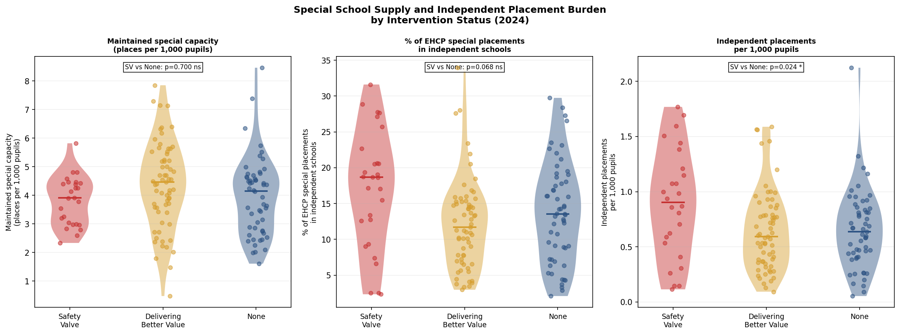
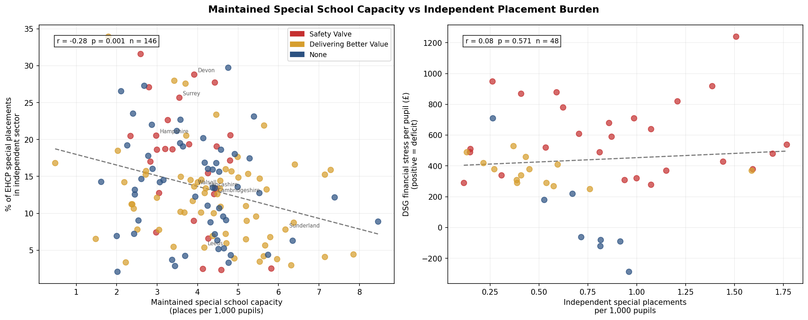
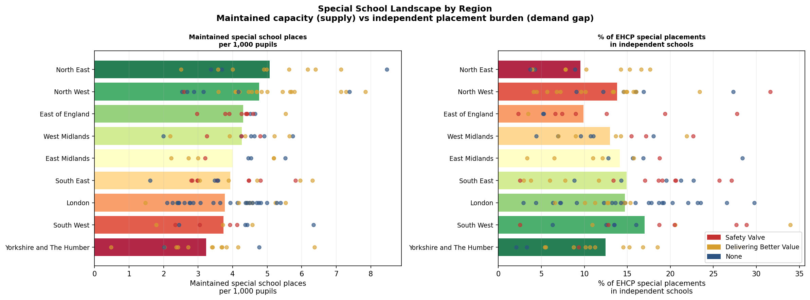

# England's SEND Crisis Is a Queue Problem, Not a Gatekeeping Problem

**New data shows financially stressed councils are not refusing more children — they're leaving families waiting for over a year**

*Analysis of DfE SEN2 2025 data and GIAS school capacity data | May 2026*

---

Every year, tens of thousands of families in England apply to their local council for an Education, Health and Care Plan (EHCP) — the legal document that unlocks specialist support for children with special educational needs. There is a legal 20-week deadline for councils to complete the assessment and issue a plan. There is also a widespread belief among SEND advocates that councils under financial pressure are quietly rejecting more applications to keep costs down.

The data tell a more complicated story.

---

## The Safety Valve programme

Since 2022, the Department for Education has quietly signed "Safety Valve" agreements with 30 local authorities. In exchange for emergency DfE funding to address their SEND high-needs budget deficits — in some cases running to hundreds of millions of pounds — these councils committed to restructuring their SEND provision and reducing the number of children on EHCPs.

Critics have argued that financial pressure, combined with explicit incentives to reduce EHCP numbers, creates conditions for systematic gatekeeping: councils refusing more applications than they should, to manage costs.

For the first time, the 2025 SEN2 statistical release from the DfE includes **official LA-level SEND Tribunal appeal rate data**, making it possible to test this hypothesis directly and at scale.

---

## What the data show

The analysis covers 151 upper-tier local authorities in England, using the DfE SEN2 2025 statistical release and the newly-published tribunal data.

### The null result: refusal rates do not differ

The most important number in this analysis is a non-finding.

In 2024, Safety Valve local authorities refused **25.3%** of EHCP assessment requests on average. Councils with no DfE intervention refused **25.1%**. The difference is statistically indistinguishable from zero (Mann-Whitney p = 0.76).

This is not what you would expect if financial pressure were driving overt gatekeeping at the front door. If anything, the data hint at the opposite: under the Difference-in-Differences analysis, Safety Valve LAs' refusal rates *fell* slightly relative to controls after programme entry (DiD estimate: −1.7 percentage points). DfE oversight under Safety Valve agreements may be actively constraining councils from making overt refusals.

The highest refusal rates in 2024 are spread across all categories: Walsall (DBV, 60.6%), Sunderland (DBV, 59.3%), Kent (SV, 55.0%), East Sussex (SV, 53.7%), Southwark (no intervention, 47.7%).

### The real finding: a timeliness catastrophe

While refusal rates look similar across the board, the picture on timeliness is stark.

In 2024, Safety Valve local authorities issued **35.8%** of EHCPs within the 20-week legal limit. For councils with no DfE intervention, the figure was **57.0%**. That is a 21-percentage-point gap, and it is highly statistically significant (Mann-Whitney p = 0.001).

To put that concretely: in the average Safety Valve council, **nearly two-thirds of children** who were assessed and found to need an EHCP waited *longer than the law requires*. In some cases, dramatically longer.

The five worst performers in 2024 were all Safety Valve LAs:

| Local authority | SV entry | 20-week compliance |
|---|---|---|
| Devon | 2024 | 3.2% |
| Cambridgeshire | 2022 | 7.7% |
| West Sussex | 2022 | 11.4% |
| Medway | 2022 | 11.7% |
| Essex | 2023 | 16.2% |

Devon issued plans on time in **3 out of every 100 cases**.

### Tribunal appeals: families are pushing back

When families disagree with their council's SEND decision, they can appeal to the SEND Tribunal. The DfE now publishes an official appeal rate for each LA — the number of appeals as a share of all appealable decisions.

Safety Valve LAs faced an average official appeal rate of **7.5%** in 2024. For councils with no intervention, it was **5.4%**. The difference is statistically significant (Mann-Whitney p = 0.045).

But — and this is the key insight — the tribunal pressure is *not* being driven by refusals. There is no significant correlation between an LA's refusal rate and its tribunal appeal rate (Pearson r = 0.13, p = 0.12). Families are not primarily appealing because they were refused an assessment; they are appealing on other grounds: the contents of the EHCP, the placement offered, or the quality of provision specified.

This matters for the causal story. It suggests that the EHCP plans being produced by financially stressed councils — often after long delays and with stretched staff — are not meeting families' needs well enough. The plans are being issued; they are just not good enough.

---

## The mechanism: capacity collapse, not gatekeeping

Taken together, the findings point to a specific failure mode that is distinct from the "gatekeeping" hypothesis.

The gatekeeping story is: council under financial pressure → refuse more applications at the front door → fewer expensive EHCPs to fund. This is not what the data show.

The capacity collapse story is: council under financial pressure → staffing cuts → applications still accepted (possibly because DfE scrutiny constrains overt refusals) → not enough staff to process cases within 20 weeks → long delays → rushed or poor-quality EHCPs when they are finally issued → families appeal the contents → legal costs mount → financial pressure deepens.

This is a different "doom loop" — and arguably a more insidious one, because it does not show up in the headline refusal rate statistics that are most commonly cited in advocacy and journalism.

---

## Were Safety Valve councils already struggling before the programme?

A critical question for interpreting these findings is whether the Safety Valve programme *caused* the performance deterioration, or whether it *identified* councils that were already struggling.

The event study analysis — comparing Safety Valve LAs to controls in the years before and after programme entry — provides a clear answer on timeliness: **Safety Valve LAs were already 10.2 percentage points worse on 20-week compliance in the three years before they entered the programme** (54.0% vs 64.2% for controls in the pre-entry period).

On tribunal appeal rates, the pre-entry gap was much smaller (+0.3 percentage points). Tribunal appeal rates were generally low across all LAs in the 2014–2019 period; the widening of the gap between Safety Valve and non-intervention LAs appears to be a more recent phenomenon.

This supports the interpretation that Safety Valve status captures pre-existing structural weakness — councils that had been underfunding their SEND provision for years before the crisis became visible in their budget. The programme has not yet reversed these structural deficits.

---

## Individual Safety Valve LA trajectories (2014–2024)

The tribunal data published for the first time in 2025 allows us to trace individual council trajectories back to 2014. The pattern is striking: most Safety Valve LAs show broadly similar tribunal rates to the national average through the mid-2010s, with divergence accelerating from roughly 2019 onwards — coinciding with rising national EHCP numbers and the Covid disruption that cleared assessment backlogs into the early 2020s.

---

## Why are Safety Valve councils disproportionately expensive?

The core puzzle is that Safety Valve councils — concentrated in the South East — are not generating more EHCP applications per pupil than elsewhere. Request rates are actually highest in the North West (5.1 per 1,000 pupils) and lowest in London and the South East (3.7 per 1,000). Nor do Safety Valve LAs have significantly higher EHCP prevalence rates.

So why are their budgets collapsing?

The answer lies in where children end up once they have an EHCP. Safety Valve councils place **0.89 children per 1,000 pupils** in independent specialist schools — compared to **0.65** for councils with no DfE intervention, a gap of 37%. Independent specialist schools charge £60,000–120,000 per year per place, sometimes more for residential provision. A council with 500 children in independent specialist placements is spending £35–50 million a year on that group alone, before transport costs.

### Testing the supply hypothesis

The obvious explanation is that South East councils simply don't have enough maintained specialist schools, so families are forced into the independent sector. Using data from the DfE's school register (GIAS) covering all 1,068 state-funded special schools in England, we can test this directly.

The simple version of the hypothesis doesn't hold: Safety Valve LAs have **3.80 maintained special school places per 1,000 pupils** — virtually identical to the 3.95 in unaffected councils (Mann-Whitney p = 0.70). They actually have *more* state special schools in their area (11.8 vs 5.7), reflecting the fact that they tend to be large shire counties rather than compact metropolitan boroughs.

The utilisation picture is equally counterintuitive. State-funded special schools across England are genuinely under pressure — nationally, they operate at **102% of their registered capacity**, with 84% running above 90% of capacity. But South East councils' maintained special schools have *lower* utilisation (99.5% of registered capacity) than councils in Yorkshire (112.7%) or the North West (107.5%). Raw overcrowding of maintained schools does not explain the South East's higher independent placement rates.

There is, however, a weaker but real relationship running in the expected direction: across all 143 LAs with complete data, councils with more maintained special school capacity per pupil do have fewer independent placements (r = −0.28, p < 0.001). The supply effect exists, but it is modest and largely absorbed by regional variation once region fixed effects are included in regression models.

### What the supply data cannot tell us

The GIAS capacity and utilisation figures capture whether a place physically exists and whether it is occupied. They do not capture whether it is the *right kind* of place. A council may have abundant maintained special school capacity for children with moderate learning difficulties but almost none for non-verbal autism or severe SEMH needs — precisely the categories driving EHCP growth nationally. Safety Valve LAs have the highest share of EHCP children with SEMH needs (23.2% vs 19.4% in unaffected LAs), a category strongly associated with independent specialist placements and tribunal disputes.

The data also cannot capture what happens when a maintained school has technically available places but is operationally full — when the physical space exists but the staffing ratios needed to safely support high-needs children are already stretched to breaking point. GIAS registered capacity is the DfE's administrative figure; it is not updated in real time to reflect a school's actual ability to take on another child with complex, high-cost needs.

Finally, there is a family advocacy dimension the data cannot resolve. In affluent South East areas, families are more likely to pursue named placements in independent schools through the SEND Tribunal — which upholds parental choice in roughly 80% of cases. A council that nominally has capacity may still be forced to fund an independent placement because a well-resourced family argued successfully at tribunal that the maintained school's provision was not appropriate for their child's specific profile. Whether this explains a meaningful share of the South East's independent placement burden cannot be determined from published data alone.

---

## What does DSG deficit actually predict?

The analysis includes regression models using DSG (Dedicated Schools Grant) deficit data from DfE S251 returns to test whether a council's financial position directly predicts its SEND outcomes.

In a restricted sample of 50 LAs with estimated DSG deficit figures, DSG deficit per pupil was a significant predictor of timeliness failure (β = −0.034 percentage points per £1 deficit per pupil, p = 0.023). This implied that a council with a £900/pupil deficit would have roughly 31 percentage points lower timeliness than an otherwise-identical balanced council.

When the sample is expanded to 150 LAs using the full S251 data, this relationship loses statistical significance (p = 0.76). The DSG carry-forward balance captures end-of-year accounting positions, not operational capacity. Region fixed effects also absorb much of the variance — Safety Valve LAs are disproportionately in the South East — making it difficult to separate the financial effect from regional structural factors with available data.

---

## What we still cannot explain

The analysis identifies what is happening with confidence: Safety Valve councils are failing on timeliness, facing higher tribunal rates, and carrying disproportionately expensive independent placement burdens. What it cannot yet close is *why* those independent placement rates are higher.

Three hypotheses remain plausible and are not mutually exclusive:

**1. Wrong type of provision.** Even where maintained special school places exist, they may not match the need profile — autism and SEMH specialist capacity may be insufficient even in LAs where total maintained capacity per pupil is adequate. Testing this would require school-level SEN specialism data matched to LA EHCP need profiles.

**2. Tribunal behaviour.** Affluent South East families, disproportionately resourced to pursue tribunal cases (which cost £5,000–15,000 in legal fees and are won by families in ~80% of cases), may be securing independent placements at higher rates regardless of maintained availability. Testing this would require tribunal outcome data broken down by LA and placement type — not currently published.

**3. Historical commissioning lock-in.** Some councils built long-standing relationships with specific independent providers and continue to use them as default placements, even where maintained alternatives have since developed. This would require historical placement data not available in the published SEN2 series.

The most policy-actionable of these hypotheses is the first. If the problem is a mismatch between the type of maintained provision available and the type of need driving placements, building more of the same kind of maintained school will not fix it. The question is whether the *right specialism* exists in the maintained sector — and that requires a different dataset.

---

## What needs to happen

The policy implications of the capacity-collapse reading differ from those of the gatekeeping reading.

If the problem is gatekeeping, the solution is scrutiny of refusal decisions — which the DfE Safety Valve agreements may already be providing. But if the problem is capacity collapse combined with an expensive placement burden, scrutiny of refusal rates is largely beside the point. It keeps the front door open while the system behind it is overwhelmed, and does nothing about the cost driver.

The families waiting more than 20 weeks in Devon, Cambridgeshire and West Sussex are not being refused. They are waiting. And while they wait, the 20-week clock runs, the child's needs go unmet, and the chances of a good outcome from the eventual assessment diminish.

Four data improvements would substantially strengthen future analysis:

1. **School-level SEN specialism data** — what types of needs each special school caters to, matched to LA EHCP need profiles. Would test the "wrong type" hypothesis directly.
2. **SEND team staffing data by LA** — DfE has this through the School Workforce Census but does not publish it at LA level in usable form. The single most important missing variable for testing the capacity-collapse mechanism.
3. **Tribunal outcome data by LA and placement type** — would test the advocacy/tribunal hypothesis and quantify how much of the independent placement burden is tribunal-driven vs council-agreed.
4. **LA-level SEND legal costs** — not published; currently invisible in financial data but essential for testing whether the tribunal cost spiral is the key feedback mechanism.

---

## Data and methodology

All data used in this analysis are from official DfE or MHCLG sources:

- **DfE SEN2 2025 statistical release** — requests, timeliness, caseload, new plans (LA-level, 2019–2024)
- **SEND Tribunal appeal rate 2014–2024** — DfE supporting file, first published 2025
- **S251 LA and School Expenditure 2024–25** — DSG carry-forward balance by LA
- **SEN pupils 2024–25** — total pupils by LA for per-pupil denominators
- **IMD 2019** — average deprivation score by upper-tier LA (IoD2019, MHCLG)
- **GIAS (Get Information About Schools)** — full establishment file, May 2026; school type, capacity, and pupil numbers for all 1,068 state-funded special schools

Intervention status (Safety Valve, Delivering Better Value) assigned from DfE programme announcements. Non-parametric group tests use Mann-Whitney U and Kruskal-Wallis H. OLS regressions include IMD 2019 average score as a deprivation control and region fixed effects.

The full analysis code, data pipeline, and outputs are available at: **[github.com/Kali89/la-send-analysis](https://github.com/Kali89/la-send-analysis)**

---

*This analysis was conducted using publicly available data. All code is open source. The author has no financial relationship with any of the organisations mentioned.*

*Corrections and methodological challenges are welcome.*
