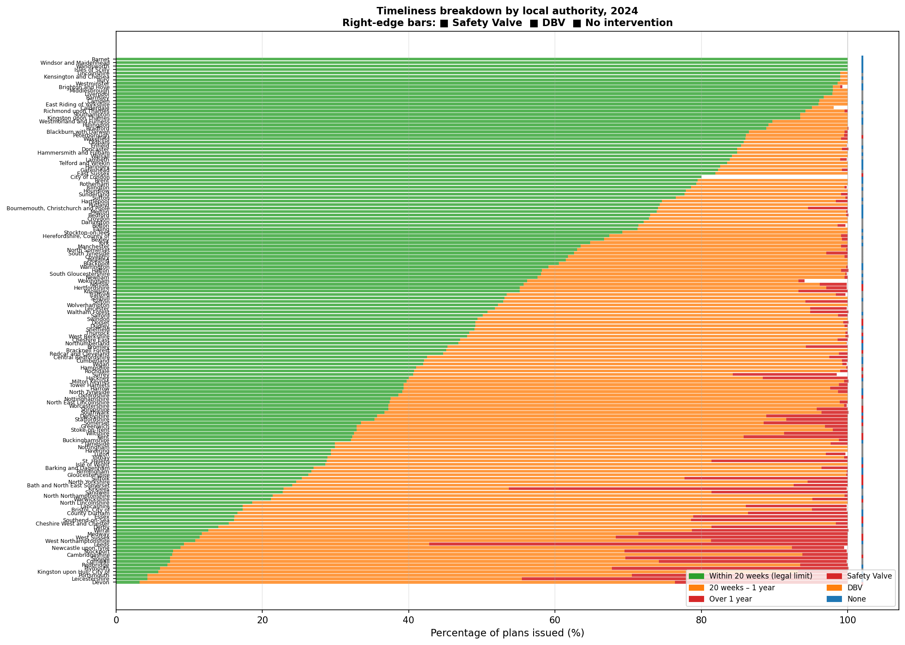
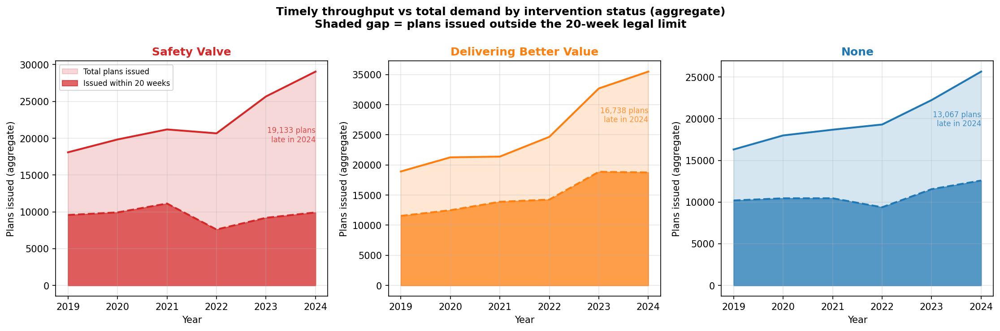
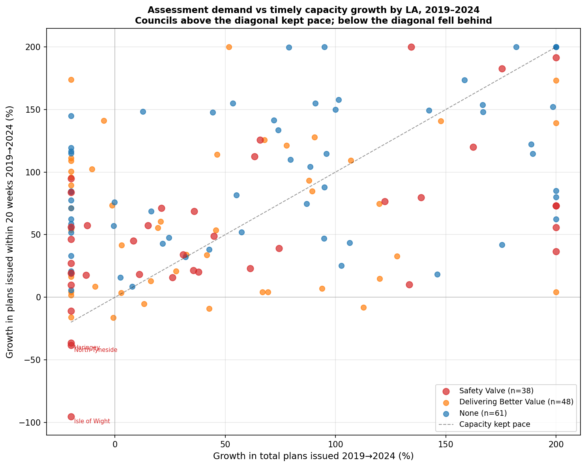
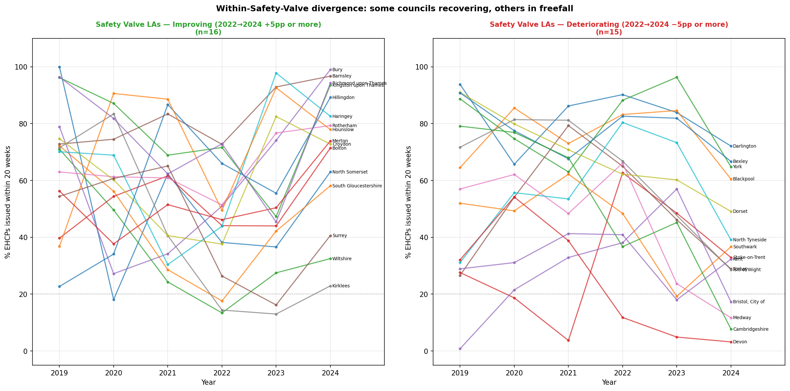
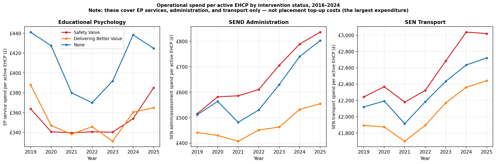
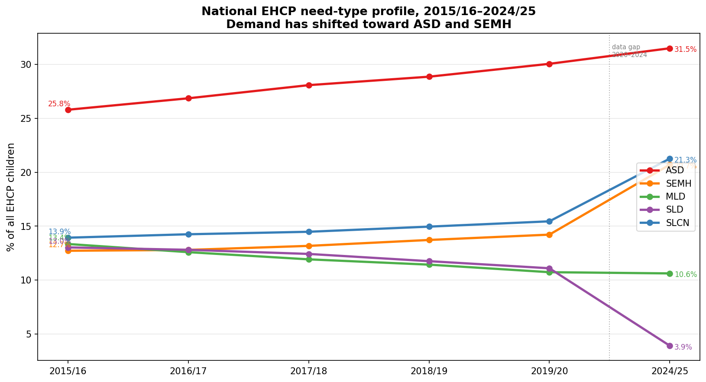
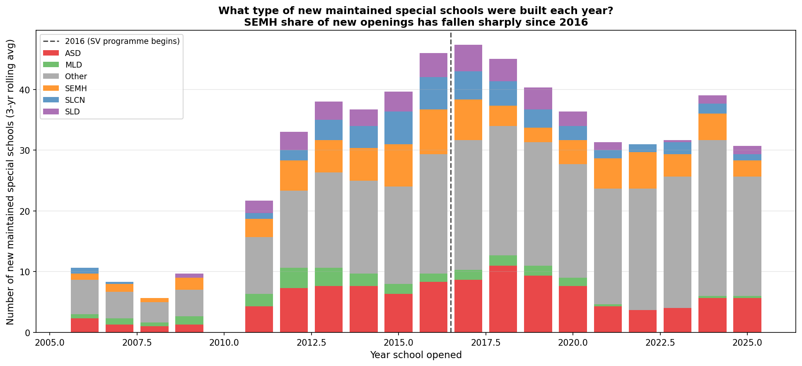
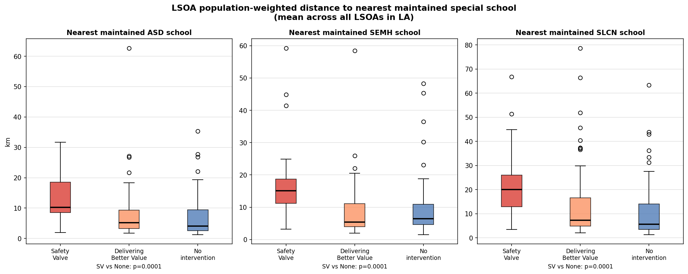

# England's SEND Crisis Is a Queue Problem, Not a Gatekeeping Problem

**New data shows financially stressed councils are not refusing more children — they're leaving families waiting for over a year**

*Analysis of DfE SEN2 2025 data and GIAS school capacity data | May 2026*

---

Every year, tens of thousands of families in England apply to their local council for an Education, Health and Care Plan (EHCP) — the legal document that unlocks specialist support for children with special educational needs. There is a legal 20-week deadline for councils to complete the assessment and issue a plan. There is also a widespread belief among SEND advocates that councils under financial pressure are quietly rejecting more applications to keep costs down.

The data tell a more complicated story.

---

## The Safety Valve programme

Since 2022, the Department for Education has quietly signed "Safety Valve" agreements with 30 local authorities. In exchange for emergency DfE funding to address their SEND high-needs budget deficits — in some cases running to hundreds of millions of pounds — these councils committed to restructuring their SEND provision and reducing the number of children on EHCPs.

Critics have argued that financial pressure, combined with explicit incentives to reduce EHCP numbers, creates conditions for systematic gatekeeping: councils refusing more applications than they should, to manage costs.

For the first time, the 2025 SEN2 statistical release from the DfE includes **official LA-level SEND Tribunal appeal rate data**, making it possible to test this hypothesis directly and at scale.

---

## What the data show

The analysis covers 151 upper-tier local authorities in England, using the DfE SEN2 2025 statistical release and the newly-published tribunal data.

### The null result: refusal rates do not differ

The most important number in this analysis is a non-finding.

In 2024, Safety Valve local authorities refused **25.3%** of EHCP assessment requests on average. Councils with no DfE intervention refused **25.1%**. The difference is statistically indistinguishable from zero (Mann-Whitney p = 0.76).

This is not what you would expect if financial pressure were driving overt gatekeeping at the front door. If anything, the data hint at the opposite: under the Difference-in-Differences analysis, Safety Valve LAs' refusal rates *fell* slightly relative to controls after programme entry (DiD estimate: −1.7 percentage points). DfE oversight under Safety Valve agreements may be actively constraining councils from making overt refusals.

The highest refusal rates in 2024 are spread across all categories: Walsall (DBV, 60.6%), Sunderland (DBV, 59.3%), Kent (SV, 55.0%), East Sussex (SV, 53.7%), Southwark (no intervention, 47.7%).

### The real finding: a timeliness catastrophe

While refusal rates look similar across the board, the picture on timeliness is stark.

In 2024, Safety Valve local authorities issued **35.8%** of EHCPs within the 20-week legal limit. For councils with no DfE intervention, the figure was **57.0%**. That is a 21-percentage-point gap, and it is highly statistically significant (Mann-Whitney p = 0.001).

To put that concretely: in the average Safety Valve council, **nearly two-thirds of children** who were assessed and found to need an EHCP waited *longer than the law requires*. In some cases, dramatically longer.

The five worst performers in 2024 were all Safety Valve LAs:

| Local authority | SV entry | 20-week compliance |
|---|---|---|
| Devon | 2024 | 3.2% |
| Cambridgeshire | 2022 | 7.7% |
| West Sussex | 2022 | 11.4% |
| Medway | 2022 | 11.7% |
| Essex | 2023 | 16.2% |

Devon issued plans on time in **3 out of every 100 cases**.

### How long are children actually waiting?

The SEN2 2025 data breaks delays into three buckets for the first time: within 20 weeks, between 20 weeks and one year, and over one year. The picture this produces is troubling.

Nationally in 2024, **45.9%** of EHCPs were issued within the legal limit, **46.9%** took between 20 weeks and a year, and **7.2%** took longer than a year. For Safety Valve LAs, the median council issued just **35.7%** within 20 weeks, with **56.9%** falling in the 20-week-to-one-year band and **4.2%** exceeding one year.

The bulk of the Safety Valve delay falls in the middle bucket — children waiting six months to a year, not the multi-year waits that generate headlines. But the scale is large: in a typical Safety Valve council, more than half of all children assessed received their plan in the 20-week-to-one-year band — arriving between around five months and a year after the original request, against a legal deadline of 20 weeks.

The worst individual >1-year outliers are not concentrated in Safety Valve authorities. Leeds (57.2% of plans took over a year, Delivering Better Value) and Kirklees (46.2%, Delivering Better Value) are the most extreme cases nationally; Leicestershire (44.6%, no intervention) is third. The timeliness crisis is worst in Safety Valve LAs as a group, but the very longest individual delays cut across all programme categories.

### Tribunal appeals: families are pushing back

When families disagree with their council's SEND decision, they can appeal to the SEND Tribunal. The DfE now publishes an official appeal rate for each LA — the number of appeals as a share of all appealable decisions.

Safety Valve LAs faced an average official appeal rate of **7.5%** in 2024. For councils with no intervention, it was **5.4%**. The difference is statistically significant (Mann-Whitney p = 0.045).

But — and this is the key insight — the tribunal pressure does not appear to be driven by refusals. There is no significant correlation between an LA's refusal rate and its tribunal appeal rate (Pearson r = 0.13, p = 0.12). This is suggestive rather than definitive: the official appeal rate uses all appealable decisions as its denominator while the refusal rate measures only initial requests, so the denominators are not directly comparable and the correlation may be partly suppressed by that mismatch. The pattern nonetheless points toward appeals on other grounds — the contents of the EHCP, the placement offered, or the quality of provision specified — rather than the initial refusal decision.

This matters for the causal story. It suggests that the EHCP plans being produced by financially stressed councils — often after long delays and with stretched staff — are not meeting families' needs well enough. The plans are being issued; they are just not good enough.

---

## The mechanism: capacity collapse, not gatekeeping

Taken together, the findings point to a specific failure mode that is distinct from the "gatekeeping" hypothesis.

The gatekeeping story is: council under financial pressure → refuse more applications at the front door → fewer expensive EHCPs to fund. This is not what the data show.

The capacity collapse story is: council under financial pressure → staffing cuts → applications still accepted (possibly because DfE scrutiny constrains overt refusals) → not enough staff to process cases within 20 weeks → long delays → rushed or poor-quality EHCPs when they are finally issued → families appeal the contents → legal costs mount → financial pressure deepens.

This is a different "doom loop" — and arguably a more insidious one, because it does not show up in the headline refusal rate statistics that are most commonly cited in advocacy and journalism.

### A capacity ceiling, not a gradual decline

The aggregate figures make the failure mode concrete. In 2019, Safety Valve LAs collectively issued **9,572 EHCPs within the 20-week limit**. In 2024, they issued **9,921** — essentially unchanged over five years. Over the same period, the total number of plans those councils were trying to issue grew from 18,091 to 29,051, an increase of **60%**.

The system hit a ceiling. Safety Valve authorities are processing roughly the same absolute number of timely cases as they were in 2019, while the queue behind them has grown by more than 10,000 children a year.

This is not what happened everywhere. Delivering Better Value councils — also under financial pressure but with a different programme structure — grew their timely output from 11,545 to 18,759 over the same period, broadly tracking demand.

### 2022: an operational collapse, not a demand surge

The timeliness rate in Safety Valve LAs had been holding around 52–53% through 2019–2021. In 2022 it fell sharply to **36.8%**, and has not recovered — it stood at 34.2% in 2024.

The obvious explanation would be a sudden surge in demand in 2022. That is not what happened. The total number of plans issued by Safety Valve LAs actually *fell* slightly in 2022 compared to 2021 (20,667 vs 21,195). But timely plans collapsed from 11,127 to 7,598 — a loss of more than 3,500 cases processed within the legal limit in a single year. This was an operational failure, concentrated at the moment the first Safety Valve agreements were being signed and the immediate post-Covid backlog was being absorbed.

### Not all Safety Valve councils are the same

The aggregate picture conceals substantial divergence within the Safety Valve group. Between 2022 and 2024, ten Safety Valve authorities improved their timeliness, some substantially: Oxfordshire recovered from 4.0% to 38.6% (+35 percentage points), Hertfordshire from 32.3% to 55.2% (+23pp), and Wiltshire from 13.4% to 32.5% (+19pp).

Against these recoveries, eighteen Safety Valve councils deteriorated over the same period. The worst declines were in Southend-on-Sea (71.7% → 16.1%, −56pp), Medway (66.1% → 11.7%, −54pp), Somerset (69.5% → 33.5%, −36pp), and Isle of Wight (66.8% → 28.6%, −38pp). These are councils that had previously been managing adequately and have since lost that capacity.

This within-group divergence matters for policy. Safety Valve is not a homogeneous category of councils uniformly in decline. Some have found ways to stabilise or improve — what they did differently is a more actionable question than the aggregate group comparison.

### What spending data reveals about capacity

The S251 LA expenditure returns allow a partial picture of what has happened to SEND assessment capacity over time, and how it differs across council types in 2024.

On educational psychologist spend per EHCP issued — the most direct proxy available for assessment capacity — Safety Valve councils are spending *less* than others: a median of **£364 per EHCP** in 2024, against **£373** in Delivering Better Value councils. This is consistent with EP workforce shortage as a constraint: fewer EPs processing more cases generates lower apparent spend-per-plan, not because councils are investing more efficiently but because the bottleneck limits throughput.

The sharpest difference is in administration spend per EHCP: Safety Valve councils spend a median of **£716**, compared to **£507** in Delivering Better Value authorities. This likely reflects the overhead of managing large caseload backlogs — more correspondence, more review meetings, more chasing — not more effective service delivery.

Transport spend per EHCP is also higher in Safety Valve authorities (median **£2,909** vs **£2,276**), consistent with their disproportionate independent specialist school placements, which tend to be further from home than maintained alternatives.

Nationally, spending on SEN administration per EHCP has risen from a median of £448 in 2019 to £571 in 2024 — a 27% real increase. EP spend has been roughly flat in nominal terms over the same period (£378 to £395), meaning it has fallen in real terms as EHCP numbers have grown. This is the spending signature of a service that is absorbing more administrative overhead to manage growing backlogs while EP capacity has not kept pace.

---

## Were Safety Valve councils already struggling before the programme?

A critical question for interpreting these findings is whether the Safety Valve programme *caused* the performance deterioration, or whether it *identified* councils that were already struggling.

The event study analysis — comparing Safety Valve LAs to controls in the years before and after programme entry — provides a clear answer on timeliness: **Safety Valve LAs were already 10.2 percentage points worse on 20-week compliance in the three years before they entered the programme** (54.0% vs 64.2% for controls in the pre-entry period).

On tribunal appeal rates, the pre-entry gap was much smaller (+0.3 percentage points). Tribunal appeal rates were generally low across all LAs in the 2014–2019 period; the widening of the gap between Safety Valve and non-intervention LAs appears to be a more recent phenomenon.

This supports the interpretation that Safety Valve status captures pre-existing structural weakness — councils that had been underfunding their SEND provision for years before the crisis became visible in their budget. The programme has not yet reversed these structural deficits.

---

## Individual Safety Valve LA trajectories (2014–2024)

The tribunal data published for the first time in 2025 allows us to trace individual council trajectories back to 2014. The pattern is striking: most Safety Valve LAs show broadly similar tribunal rates to the national average through the mid-2010s, with divergence accelerating from roughly 2019 onwards — coinciding with rising national EHCP numbers and the Covid disruption that cleared assessment backlogs into the early 2020s.

---

## Why are Safety Valve councils disproportionately expensive?

The core puzzle is that Safety Valve councils — concentrated in the South East — are not generating more EHCP applications per pupil than elsewhere. Request rates are actually highest in the North West (5.1 per 1,000 pupils) and lowest in London and the South East (3.7 per 1,000). Nor do Safety Valve LAs have significantly higher EHCP prevalence rates.

So why are their budgets collapsing?

The answer lies in where children end up once they have an EHCP. Safety Valve councils place **0.89 children per 1,000 pupils** in independent specialist schools — compared to **0.65** for councils with no DfE intervention, a gap of 37%. Independent specialist schools charge £60,000–120,000 per year per place, sometimes more for residential provision. A council with 500 children in independent specialist placements is spending £35–50 million a year on that group alone, before transport costs.

### Testing the supply hypothesis

The obvious explanation is that South East councils simply don't have enough maintained specialist schools, so families are forced into the independent sector. Using data from the DfE's school register (GIAS) covering all 1,068 state-funded special schools in England, we can test this directly.

The maintained supply version of the hypothesis doesn't hold: Safety Valve LAs have **3.80 maintained special school places per 1,000 pupils** — virtually identical to the 3.95 in unaffected councils (Mann-Whitney p = 0.70). They actually have *more* state special schools in their area (11.8 vs 5.7), reflecting the fact that they tend to be large shire counties rather than compact metropolitan boroughs.

The utilisation picture is equally counterintuitive. State-funded special schools across England are genuinely under pressure — nationally, they operate at **102% of their registered capacity**, with 84% running above 90% of capacity. But South East councils' maintained special schools have *lower* utilisation (99.5% of registered capacity) than councils in Yorkshire (112.7%) or the North West (107.5%). Raw overcrowding of maintained schools does not explain the South East's higher independent placement rates.

There is a weaker but real relationship in the expected direction: councils with more maintained special school capacity per pupil do have somewhat fewer independent placements (r = −0.28, p < 0.001). But this is modest and largely absorbed by regional variation once region fixed effects are included.

### Independent supply is the stronger predictor

When we test independent special school capacity per pupil — rather than maintained — a different and stronger relationship emerges. Across 135 LAs with complete data, independent special school capacity per 1,000 pupils explains **22.5% of the variance** in independent placement rates (β = 0.197, p < 0.001). By contrast, deprivation (IMD) alone explains less than 1% of the variance in placement rates (R² = 0.009, p = 0.26). When both variables enter the same regression, the IMD coefficient collapses to zero (p = 0.87) — it is entirely absorbed by independent supply.

This is the strongest statistical predictor of independent placement rates in the dataset. Areas with more independent special school places nearby have more independent placements. The relationship holds even after controlling for deprivation.

What this finding cannot tell us is which direction the causal arrow runs. Did independent schools establish themselves in areas because existing demand was already there, or does their presence subsequently generate placements? The cross-sectional data cannot resolve this. It is consistent with both a demand-led story (families in certain areas pushed for independent placements, and supply followed) and a supply-led story (more available schools make independent placements a more readily used option). Resolving this would require historical data on when independent schools opened relative to when placement rates rose — data not currently published.

### A decade of shifting need

The supply hypothesis — maintained schools exist but aren't the right type — can be tested directly now that historical EHCP need-type data is available from 2015/16 onwards.

The national EHCP need profile has shifted substantially over the decade:

| Need type | 2015/16 | 2024/25 | Change |
|---|---|---|---|
| Autistic Spectrum Disorder | 25.8% | 31.5% | +5.7pp |
| Social, Emotional and Mental Health | 12.7% | 20.7% | +8.0pp |
| Moderate Learning Difficulty | 13.4% | 10.6% | −2.8pp |
| Speech, Language and Communication | 13.9% | 21.3% | +7.4pp |

SEMH as a share of all EHCP children has grown by **8 percentage points in ten years** — from roughly 1 in 8 to 1 in 5. ASD has grown by nearly 6 points. The population of children with EHCPs has changed, even if the maintained school estate has not.

This demand shift has been consistent across all council types. Safety Valve LAs have seen SEMH grow by 8.3 percentage points since 2015/16 — marginally more than Delivering Better Value councils (7.3pp) or unaffected councils (7.3pp), consistent with their higher current SEMH prevalence.

Meanwhile, new maintained special school openings have moved in the wrong direction. Among maintained special schools with known opening dates, **SEMH schools accounted for 21.6% of new openings before 2016**. Since 2016, that figure has fallen to **11.2%**. ASD-specialist schools have held roughly steady as a proportion of new openings (19.9% pre-2016, 18.2% post-2016). The maintained sector is building capacity broadly in line with pre-existing provision profiles, not shifting toward where need has grown fastest.

The result is a structural gap that is now universal. Across all 150 local authorities with complete data, the share of EHCP children with SEMH needs exceeds the share of maintained special school capacity designated for SEMH — by a median of **13 percentage points nationally**. The ASD gap is similar in magnitude (+17pp). Safety Valve LAs show a specifically larger SEMH gap (+16pp) than Delivering Better Value (+11pp) or unaffected councils (+13pp), while their ASD gap is somewhat smaller (+12pp), consistent with their historically larger ASD-specialist school stock.

Critically, this provision mismatch does not, by itself, predict which councils spend the most on independent placements — the mismatch is too universal for that (all councils face it). What matters, as the next section shows, is whether the SEMH provision that does exist is accessible to the population that needs it.

### Access gaps, not geography

An alternative framing of the supply question is not about how many places exist, but how far families are from them. Using population-weighted centroids for all 33,755 Lower Layer Super Output Areas (LSOAs) in England, matched to the location of every maintained special school by primary SEN type, we can compute the mean distance from each LA's population to its nearest maintained SEMH or ASD school.

When these distance measures enter a regression predicting independent placement top-up spend per EHCP (S251 line 1.2.3, 2023/24), one finding is significant and one is a clear null.

The **mean distance to the nearest maintained SEMH school is a significant positive predictor of independent spend per EHCP** (β = +0.016 per km, p = 0.003): councils whose populations live further from state SEMH provision spend more on independent placements, after controlling for need-type profile (% ASD, % SEMH), deprivation, EHCP prevalence, and region. The relationship holds even with all 152 upper-tier LAs in the model — a notably larger and more geographically representative sample than the DSG-deficit regressions, which were limited to 50 LAs. Distance to ASD provision is in the expected direction but weaker (p = 0.06).

The null is equally informative: **geographic population dispersal — how spread-out the LA's population is relative to its own centroid — has no predictive value** (p = 0.84). A sprawling shire county with population distributed across market towns does not spend more on independent placements than a compact urban authority, once the actual provision distance is controlled for. This is because special schools, both maintained and independent, tend to locate near the populations they serve. Dispersal matters only insofar as it creates provision gaps; it does not independently drive cost. The expensive councils are not expensive because they are large — they are expensive because SEMH provision is thin relative to the need profile of their population.

Taken together with the independent supply findings, this points toward a consistent picture: the independent placement cost burden is driven by a mismatch between the type of provision available in the maintained sector and the needs of EHCP children in that area, particularly for SEMH. Where that gap exists, families — and tribunals — fill it with independent placements.

The model using structural access and demographic factors explains **27% of the variance** in independent placement spend across councils (R² = 0.27, n = 146 with complete data). Safety Valve LAs show a median actual-to-predicted spend ratio of **1.09x** — modestly above what their structural characteristics would predict, but not dramatically so. The biggest outliers are Merton (no intervention, 3.2x predicted), Medway (Safety Valve, 2.6x), and Barnsley (Delivering Better Value, 2.6x). The remaining 73% of variance is unexplained by structural access factors and demographics — almost certainly reflecting historical commissioning patterns, tribunal behaviour, and local authority-specific decisions that cross-sectional data cannot capture.

### What the supply data cannot tell us

The GIAS capacity and utilisation figures capture whether a place physically exists and whether it is occupied. They do not capture whether it is the *right kind* of place. A council may have abundant maintained special school capacity for children with moderate learning difficulties but almost none for non-verbal autism or severe SEMH needs — precisely the categories driving EHCP growth nationally. Safety Valve LAs have the highest share of EHCP children with SEMH needs (23.2% vs 19.4% in unaffected LAs), a category strongly associated with independent specialist placements and tribunal disputes.

GIAS registered capacity is also the DfE's administrative figure; it is not updated in real time to reflect a school's actual ability to take on another child with complex, high-cost needs. A school that nominally has available places may be operationally at capacity given current staffing ratios.

---

## What does DSG deficit actually predict?

The analysis includes regression models using DSG (Dedicated Schools Grant) deficit data from DfE S251 returns to test whether a council's financial position directly predicts its SEND outcomes.

In a restricted sample of 50 LAs with estimated DSG deficit figures, DSG deficit per pupil was a significant predictor of timeliness failure (β = −0.034 percentage points per £1 deficit per pupil, p = 0.023). This implied that a council with a £900/pupil deficit would have roughly 31 percentage points lower timeliness than an otherwise-identical balanced council.

When the sample is expanded to 150 LAs using the full S251 data, this relationship loses statistical significance (p = 0.76). The DSG carry-forward balance captures end-of-year accounting positions, not operational capacity. Region fixed effects also absorb much of the variance — Safety Valve LAs are disproportionately in the South East — making it difficult to separate the financial effect from regional structural factors with available data.

---

## What we still cannot explain

The analysis identifies what is happening with confidence: Safety Valve councils are failing on timeliness, facing higher tribunal rates, and carrying disproportionately expensive independent placement burdens. What it cannot yet close is *why* those independent placement rates are higher.

The strongest statistical signal in the data is the density of independent special school supply: areas with more independent special school places per pupil have significantly more independent placements (R² = 0.225). But the cross-sectional data cannot determine whether supply preceded demand or followed it.

Three further hypotheses remain plausible and are not mutually exclusive:

**1. Wrong type of provision.** The need-type and supply analysis above confirms this is a real and universal problem: SEMH need has grown by 8 percentage points since 2015/16 while new maintained SEMH school openings have halved as a share of the new-build programme. The LSOA access analysis reinforces it: SEMH distance is a significant predictor of independent spend. But the mismatch is too uniform across council types to explain which specific LAs spend the most — what varies is geographic access to the SEMH provision that does exist.

**2. Tribunal behaviour.** Families who successfully argue at tribunal for a named independent placement create a placement the council must fund. SEND Tribunal upholds parental choice in roughly 80% of cases. Whether Safety Valve councils lose tribunal cases at higher rates — and whether those losses explain a disproportionate share of their independent placements — requires tribunal outcome data broken down by LA and placement type, which is not currently published.

**3. Historical commissioning lock-in.** Some councils may have built long-standing relationships with specific independent providers and continue to use them as default placements, even where maintained alternatives have since developed. This would require historical placement data not available in the published SEN2 series.

The most policy-actionable of these hypotheses is the first. If the problem is a mismatch between the type of maintained provision available and the type of need driving placements, building more of the same kind of maintained school will not fix it. The question is whether the *right specialism* exists in the maintained sector — and that requires a different dataset.

---

## The full picture: a causal chain

The seven analytical threads in this piece converge on a single account. It is worth stating it plainly before drawing conclusions.

**Over the past decade, the population of children with EHCPs changed.** Social, Emotional and Mental Health needs grew from 13% to 21% of all EHCP children between 2015/16 and 2024/25 — an 8 percentage-point shift. Autistic Spectrum Disorder grew from 26% to 32%. These are the two most contested, most expensive-to-place categories, and the most likely to end in tribunal when the provision offered is unsuitable.

**The maintained school estate did not follow.** SEMH schools fell from 22% to 11% of new maintained special school openings over the same period. Places grew, but in the wrong proportions. This mismatch is not a South East problem — it is national, running at a median of 13–16 percentage points across all council types.

**What makes some councils expensive is access, not supply volume.** The maintained SEMH provision that does exist is unevenly accessible. Councils whose populations live further from their nearest maintained SEMH school spend significantly more on independent placements (β = +0.016 per km, p = 0.003, n = 146). Safety Valve LAs — large South East shire counties like Hampshire, Surrey, Hertfordshire, West Sussex — tend to have SEMH schools concentrated in county towns, leaving rural populations far from any state alternative. Geographic size alone is not the mechanism: how spread-out a council's population is has no independent predictive value (p = 0.84) once actual provision distance is measured. They are not expensive because they are large; they are expensive because the SEMH provision that does exist is in the wrong places.

**The cost consequence is independent specialist placements.** Safety Valve LAs place 0.89 children per 1,000 pupils in independent specialist schools, against 0.65 in councils with no intervention — a 37% gap. At £60,000–120,000 per place per year, this is almost certainly the primary driver of DSG deficits. They do not have fewer maintained places per pupil overall (3.80 vs 3.95, p = 0.70); they have the wrong mix, inaccessibly located.

**Financial pressure feeds back into operational failure.** DSG deficits → staffing cuts → EP workforce shrinkage → fewer assessments completed within 20 weeks → growing backlogs → rushed or thin plans when they finally arrive → families challenge the quality at tribunal → legal costs and further placements deepen the deficit. The spending data tells this story directly: Safety Valve LAs spend 41% more per EHCP on administration (£716 vs £507, consistent with caseworkers managing growing backlogs rather than delivering efficiently), while EP spend per plan is flat — not reflecting efficiency but the bottleneck on throughput.

**The timeliness failure predated the Safety Valve programme.** In the three years before entering the programme, Safety Valve LAs were already 10.2 percentage points worse on 20-week compliance than similar councils. The 2022 operational collapse — 3,500 fewer plans issued within the legal limit in a single year, with no corresponding demand surge — was the point at which structural pressure became undeniable. The programme found a problem that was already there; it has not reversed it.

**Tribunal appeals are the endpoint, not the origin.** Safety Valve LAs face appeal rates of 7.5% versus 5.4% elsewhere (p = 0.045). But there is no significant correlation between refusal rates and appeal rates (r = 0.13, p = 0.12). Families are not primarily appealing because they were refused. They are appealing the quality and contents of plans produced after long delays by overstretched teams who have been managing a throughput ceiling of roughly 9,500 timely cases per year while total demand grew 60% since 2019.

**The headline metric most commonly scrutinised shows nothing.** EHCP refusal rates in Safety Valve councils: 25.3%. In councils with no intervention: 25.1%. The difference is indistinguishable from zero (p = 0.76). DfE oversight under Safety Valve agreements may be actively constraining overt refusals at the front door. What is escaping scrutiny is the queue behind it.

The crisis in Safety Valve local authorities is not a gatekeeping crisis. It is the terminal expression of a structural mismatch between what the maintained special school system was built to provide and what the EHCP population now needs — playing out through the finances of large South East shire counties that have been funding the gap with expensive independent placements for years, and whose budgets, staffing, and assessment capacity have been hollowing out as a result.

---

## What needs to happen

The policy implications of the capacity-collapse reading differ from those of the gatekeeping reading.

If the problem is gatekeeping, the solution is scrutiny of refusal decisions — which the DfE Safety Valve agreements may already be providing. But if the problem is capacity collapse combined with an expensive placement burden, scrutiny of refusal rates is largely beside the point. It keeps the front door open while the system behind it is overwhelmed, and does nothing about the cost driver.

The families waiting more than 20 weeks in Devon, Cambridgeshire and West Sussex are not being refused. They are waiting. And while they wait, the 20-week clock runs, the child's needs go unmet, and the chances of a good outcome from the eventual assessment diminish.

Four data improvements would substantially strengthen future analysis:

1. **School-level SEN specialism data** — what types of needs each special school caters to, matched to LA EHCP need profiles. Would test the "wrong type" hypothesis directly.
2. **SEND team staffing data by LA** — DfE has this through the School Workforce Census but does not publish it at LA level in usable form. The single most important missing variable for testing the capacity-collapse mechanism. S251 spending data (used here) is a proxy, but staffing headcount would be far more direct.
3. **Tribunal outcome data by LA and placement type** — would test the advocacy/tribunal hypothesis and quantify how much of the independent placement burden is tribunal-driven vs council-agreed.
4. **LA-level SEND legal costs** — not published; currently invisible in financial data but essential for testing whether the tribunal cost spiral is the key feedback mechanism.

---

## Data and methodology

All data used in this analysis are from official DfE or MHCLG sources:

- **DfE SEN2 2025 statistical release** — requests, timeliness, caseload, new plans (LA-level, 2019–2024); timeliness three-bucket breakdown (within 20w / 20w–1yr / >1yr) available for 2023–2024
- **SEND Tribunal appeal rate 2014–2024** — DfE supporting file, first published 2025
- **S251 LA and School Expenditure 2015/16–2024/25** — DSG carry-forward balance by LA; EP service (line 2.1.1), SEN administration (2.1.2), and SEN transport (2.1.4) expenditure by LA across ten years
- **SEN pupils 2024–25** — total pupils by LA for per-pupil denominators
- **IMD 2019** — average deprivation score by upper-tier LA (IoD2019, MHCLG)
- **GIAS (Get Information About Schools)** — full establishment file, May 2026; school type, capacity, and pupil numbers for all 1,068 state-funded special schools
- **LSOA 2021 population-weighted centroids** — ONS ArcGIS (33,755 England LSOAs), joined to upper-tier LA via ONS LSOA21–UTLA22 lookup; per-LSOA distances computed by vectorised nearest-neighbour search (scipy cKDTree) against all maintained special schools by primary SEN type
- **SEN2 historical need-type data (2015/16–2019/20)** — DfE SEN2 2019–20 release, `sen_age_gender.csv`; LA-level EHCP pupils by primary need type for five academic years; joined to current 2024/25 data to form the ten-year demand trend

Intervention status (Safety Valve, Delivering Better Value) assigned from DfE programme announcements. Non-parametric group tests use Mann-Whitney U and Kruskal-Wallis H. OLS regressions include IMD 2019 average score as a deprivation control and region fixed effects.

The full analysis code, data pipeline, and outputs are available at: **[github.com/Kali89/la-send-analysis](https://github.com/Kali89/la-send-analysis)**

---

*This analysis was conducted using publicly available data. All code is open source. The author has no financial relationship with any of the organisations mentioned.*

*Corrections and methodological challenges are welcome.*
