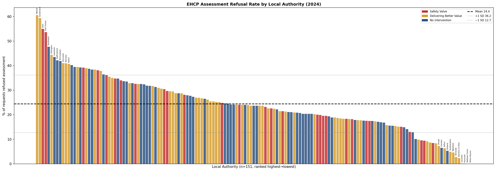
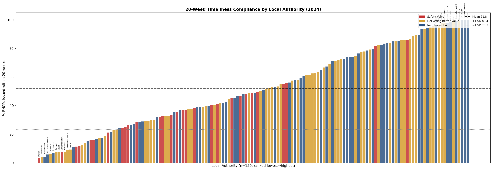
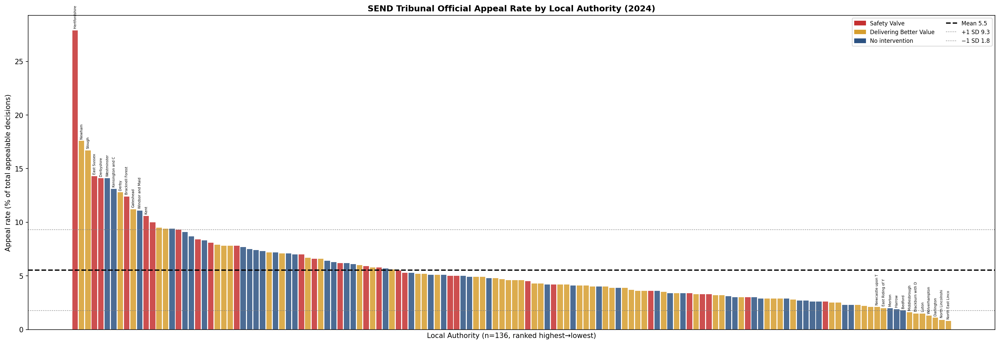
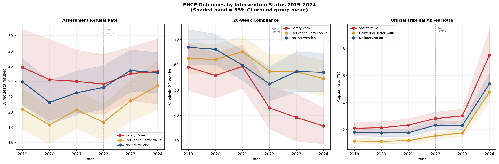
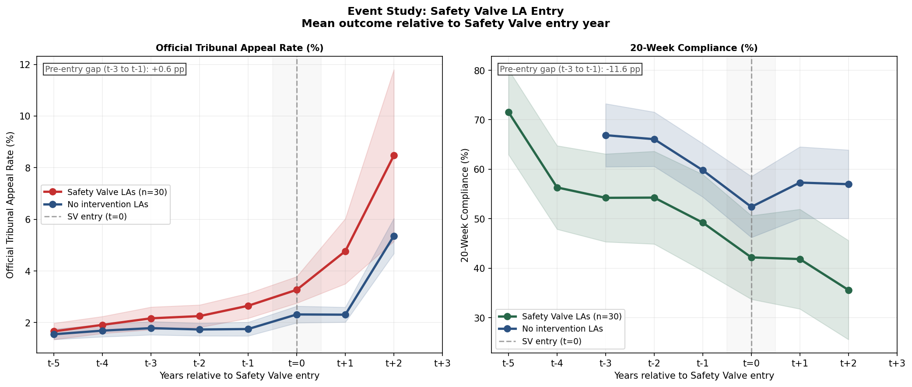
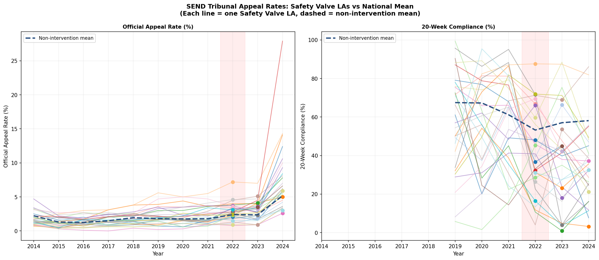

# England's SEND Crisis Is a Queue Problem, Not a Gatekeeping Problem

**New data shows financially stressed councils are not refusing more children — they're leaving families waiting for over a year**

*Analysis of DfE SEN2 2025 data | May 2026*

---

Every year, tens of thousands of families in England apply to their local council for an Education, Health and Care Plan (EHCP) — the legal document that unlocks specialist support for children with special educational needs. There is a legal 20-week deadline for councils to complete the assessment and issue a plan. There is also a widespread belief among SEND advocates that councils under financial pressure are quietly rejecting more applications to keep costs down.

The data tell a more complicated story.

---

## The Safety Valve programme

Since 2022, the Department for Education has quietly signed "Safety Valve" agreements with 30 local authorities. In exchange for emergency DfE funding to address their SEND high-needs budget deficits — in some cases running to hundreds of millions of pounds — these councils committed to restructuring their SEND provision and reducing the number of children on EHCPs.

Critics have argued that financial pressure, combined with explicit incentives to reduce EHCP numbers, creates conditions for systematic gatekeeping: councils refusing more applications than they should, to manage costs.

For the first time, the 2025 SEN2 statistical release from the DfE includes **official LA-level SEND Tribunal appeal rate data**, making it possible to test this hypothesis directly and at scale.

---

## What the data show

The analysis covers 151 upper-tier local authorities in England, using the DfE SEN2 2025 statistical release and the newly-published tribunal data.

### The null result: refusal rates do not differ

The most important number in this analysis is a non-finding.

In 2024, Safety Valve local authorities refused **25.3%** of EHCP assessment requests on average. Councils with no DfE intervention refused **25.1%**. The difference is statistically indistinguishable from zero (Mann-Whitney p = 0.76).

This is not what you would expect if financial pressure were driving overt gatekeeping at the front door. If anything, the data hint at the opposite: under the Difference-in-Differences analysis, Safety Valve LAs' refusal rates *fell* slightly relative to controls after programme entry (DiD estimate: −1.7 percentage points). DfE oversight under Safety Valve agreements may be actively constraining councils from making overt refusals.

The highest refusal rates in 2024 are spread across all categories: Walsall (DBV, 60.6%), Sunderland (DBV, 59.3%), Kent (SV, 55.0%), East Sussex (SV, 53.7%), Southwark (no intervention, 47.7%).

### The real finding: a timeliness catastrophe

While refusal rates look similar across the board, the picture on timeliness is stark.

In 2024, Safety Valve local authorities issued **35.8%** of EHCPs within the 20-week legal limit. For councils with no DfE intervention, the figure was **57.0%**. That is a 21-percentage-point gap, and it is highly statistically significant (Mann-Whitney p = 0.001).

To put that concretely: in the average Safety Valve council, **nearly two-thirds of children** who were assessed and found to need an EHCP waited *longer than the law requires*. In some cases, dramatically longer.

The five worst performers in 2024 were all Safety Valve LAs:

| Local authority | SV entry | 20-week compliance |
|---|---|---|
| Devon | 2024 | 3.2% |
| Cambridgeshire | 2022 | 7.7% |
| West Sussex | 2022 | 11.4% |
| Medway | 2022 | 11.7% |
| Essex | 2023 | 16.2% |

Devon issued plans on time in **3 out of every 100 cases**.

### Tribunal appeals: families are pushing back

When families disagree with their council's SEND decision, they can appeal to the SEND Tribunal. The DfE now publishes an official appeal rate for each LA — the number of appeals as a share of all appealable decisions.

Safety Valve LAs faced an average official appeal rate of **7.5%** in 2024. For councils with no intervention, it was **5.4%**. The difference is statistically significant (Mann-Whitney p = 0.045).

But — and this is the key insight — the tribunal pressure is *not* being driven by refusals. There is no significant correlation between an LA's refusal rate and its tribunal appeal rate (Pearson r = 0.13, p = 0.12). Families are not primarily appealing because they were refused an assessment; they are appealing on other grounds: the contents of the EHCP, the placement offered, or the quality of provision specified.

This matters for the causal story. It suggests that the EHCP plans being produced by financially stressed councils — often after long delays and with stretched staff — are not meeting families' needs well enough. The plans are being issued; they are just not good enough.

---

## The mechanism: capacity collapse, not gatekeeping

Taken together, the findings point to a specific failure mode that is distinct from the "gatekeeping" hypothesis.

The gatekeeping story is: council under financial pressure → refuse more applications at the front door → fewer expensive EHCPs to fund. This is not what the data show.

The capacity collapse story is: council under financial pressure → staffing cuts → applications still accepted (possibly because DfE scrutiny constrains overt refusals) → not enough staff to process cases within 20 weeks → long delays → rushed or poor-quality EHCPs when they are finally issued → families appeal the contents → legal costs mount → financial pressure deepens.

This is a different "doom loop" — and arguably a more insidious one, because it does not show up in the headline refusal rate statistics that are most commonly cited in advocacy and journalism.

---

## Were Safety Valve councils already struggling before the programme?

A critical question for interpreting these findings is whether the Safety Valve programme *caused* the performance deterioration, or whether it *identified* councils that were already struggling.

The event study analysis — comparing Safety Valve LAs to controls in the years before and after programme entry — provides a clear answer on timeliness: **Safety Valve LAs were already 10.2 percentage points worse on 20-week compliance in the three years before they entered the programme** (54.0% vs 64.2% for controls in the pre-entry period).

On tribunal appeal rates, the pre-entry gap was much smaller (+0.3 percentage points). Tribunal appeal rates were generally low across all LAs in the 2014–2019 period; the widening of the gap between Safety Valve and non-intervention LAs appears to be a more recent phenomenon.

This supports the interpretation that Safety Valve status captures pre-existing structural weakness — councils that had been underfunding their SEND provision for years before the crisis became visible in their budget. The programme has not yet reversed these structural deficits.

---

## Individual Safety Valve LA trajectories (2014–2024)

The tribunal data published for the first time in 2025 allows us to trace individual council trajectories back to 2014. The pattern is striking: most Safety Valve LAs show broadly similar tribunal rates to the national average through the mid-2010s, with divergence accelerating from roughly 2019 onwards — coinciding with rising national EHCP numbers and the Covid disruption that cleared assessment backlogs into the early 2020s.

---

## What does DSG deficit actually predict?

The analysis includes regression models using DSG (Dedicated Schools Grant) deficit data from DfE S251 returns to test whether a council's financial position directly predicts its SEND outcomes.

In a restricted sample of 50 LAs with estimated DSG deficit figures, DSG deficit per pupil was a significant predictor of timeliness failure (β = −0.034 percentage points per £1 deficit per pupil, p = 0.023). This implied that a council with a £900/pupil deficit would have roughly 31 percentage points lower timeliness than an otherwise-identical balanced council.

When the sample is expanded to 150 LAs using the full S251 data, this relationship loses statistical significance (p = 0.76). This likely reflects a genuine limitation: the DSG deficit measure captures end-of-year accounting balances, not operational capacity. A council can have a large paper deficit while still processing EHCPs adequately, and vice versa. The region fixed effects also absorb much of the variance — Safety Valve LAs are disproportionately in the South East — making it difficult to separate the financial effect from regional structural factors.

The DSG deficit data is therefore a useful indicator of financial pressure at the macro level (it is how the DfE identifies Safety Valve candidates) but is not, on its own, a reliable predictor of individual LA SEND performance.

---

## Mediation analysis

The analysis tested whether the pathway from DSG deficit to tribunal appeals operates *through* operational capacity stress (throughput of cases) and timeliness failure — the capacity-collapse story in quantitative form. Using Baron-Kenny mediation analysis with a sample of 134 LAs, all pathways were non-significant.

This null result is most likely a power and measurement issue rather than evidence against the mechanism. The DSG carry-forward balance, as noted above, is a coarse proxy for operational stress, and 134 LAs provides limited power to detect mediation across a two-mediator chain. Future work with a direct SEND staffing measure (SEND team FTE per 1,000 active EHCPs) would provide a more powerful test of the capacity-collapse hypothesis.

---

## What needs to happen

The policy implications of the capacity-collapse reading differ from those of the gatekeeping reading.

If the problem is gatekeeping, the solution is scrutiny of refusal decisions — which the DfE Safety Valve agreements may already be providing. But if the problem is capacity collapse, scrutiny of refusal rates is insufficient and potentially counterproductive: it keeps the front door open while the system behind it is overwhelmed.

The families waiting more than 20 weeks in Devon, Cambridgeshire and West Sussex are not being refused. They are waiting. And while they wait, the 20-week clock continues, the child's needs go unmet, and the chance of a good outcome from the eventual assessment diminishes.

Three changes to the data infrastructure would substantially strengthen future analysis:

1. **SEND team staffing data** by LA — DfE has this through the School Workforce Census but does not publish it at LA level in a usable form.
2. **LA-level SEND legal costs** — currently invisible in published financial data but crucial for testing the tribunal cost spiral.
3. **Pre-2019 SEN2 process data** — extending the panel to match the tribunal data's 2014 start would allow proper parallel-trends testing for the event study.

---

## Data and methodology

All data used in this analysis are from official DfE sources, loaded programmatically:

- **DfE SEN2 2025 statistical release** — requests, timeliness, caseload, new plans (LA-level, 2019–2024)
- **SEND Tribunal appeal rate 2014–2024** — DfE supporting file, first published 2025
- **S251 LA and School Expenditure 2024–25** — DSG carry-forward balance by LA
- **SEN pupils 2024–25** — total pupils by LA for per-pupil denominators
- **IMD 2019** — average deprivation score by upper-tier LA (IoD2019, MHCLG)

Intervention status (Safety Valve, Delivering Better Value) assigned from DfE programme announcements. Non-parametric group tests use Mann-Whitney U and Kruskal-Wallis H. OLS regressions include IMD 2019 average score as a deprivation control and region fixed effects.

The full analysis code, data pipeline, and outputs are available at: **[github.com/Kali89/la-send-analysis](https://github.com/Kali89/la-send-analysis)**

---

*This analysis was conducted using publicly available data. All code is open source. The author has no financial relationship with any of the organisations mentioned.*

*Corrections and methodological challenges are welcome.*
