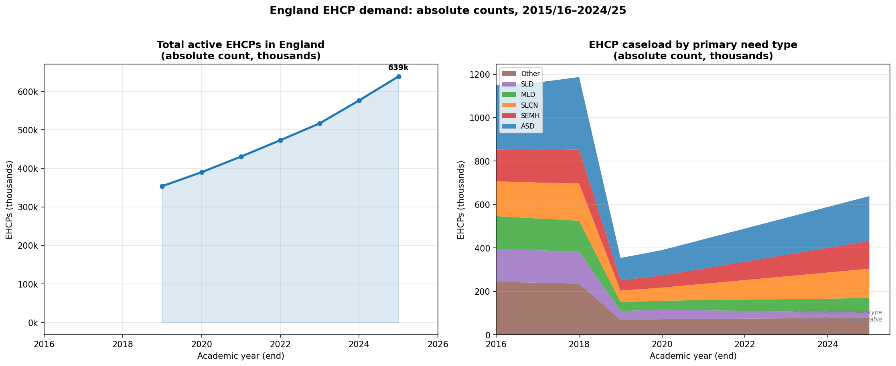
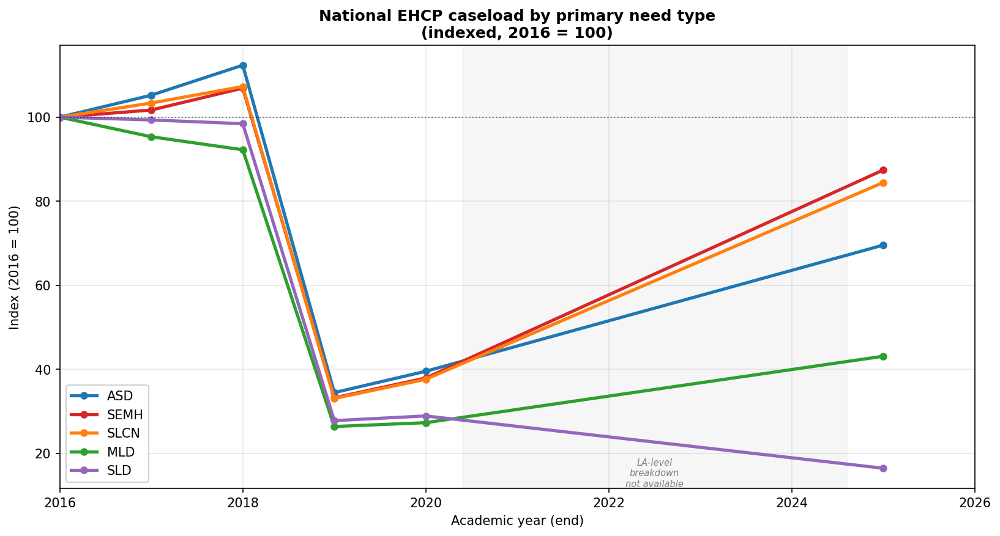
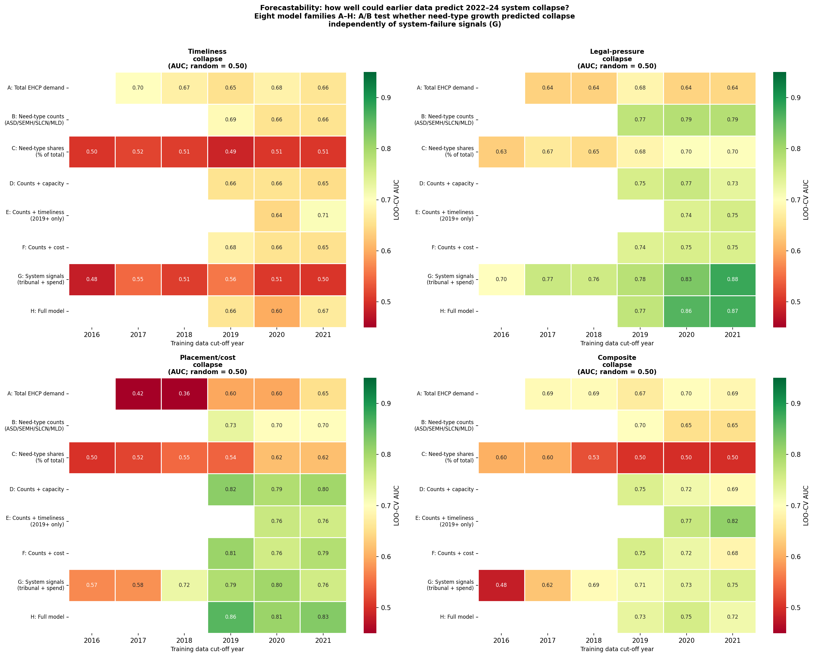
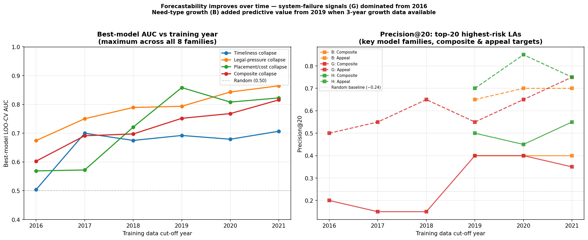
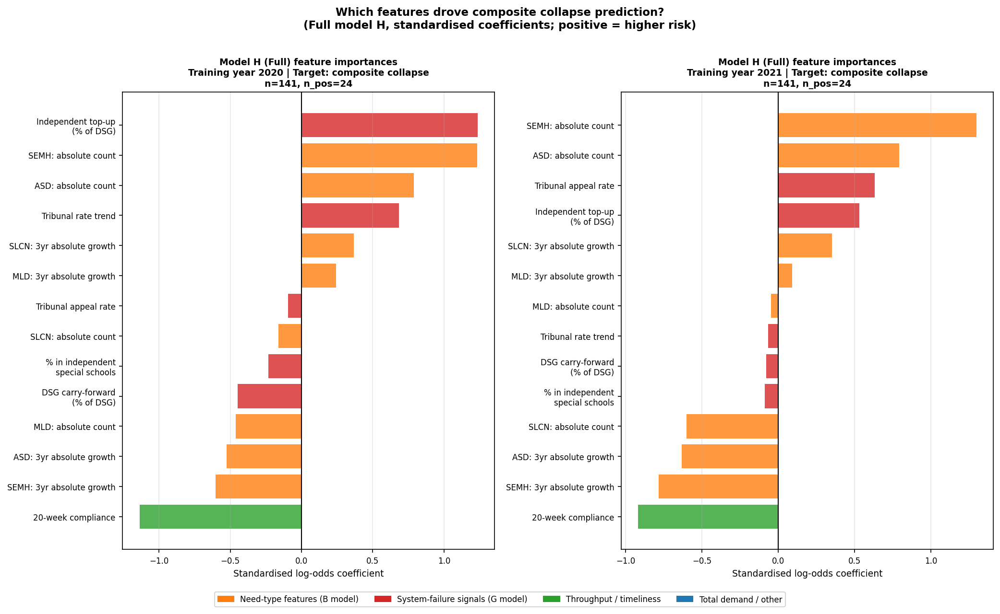
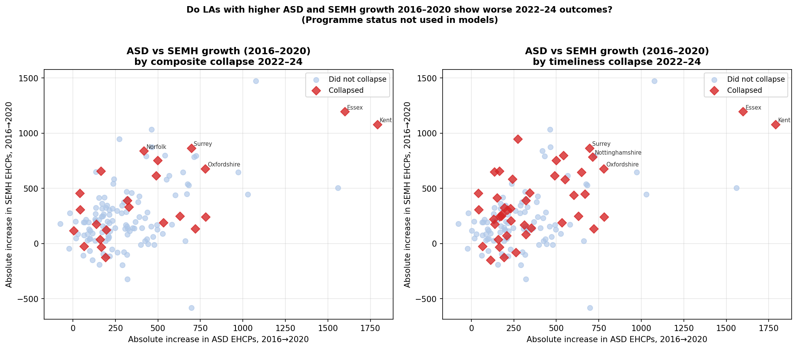
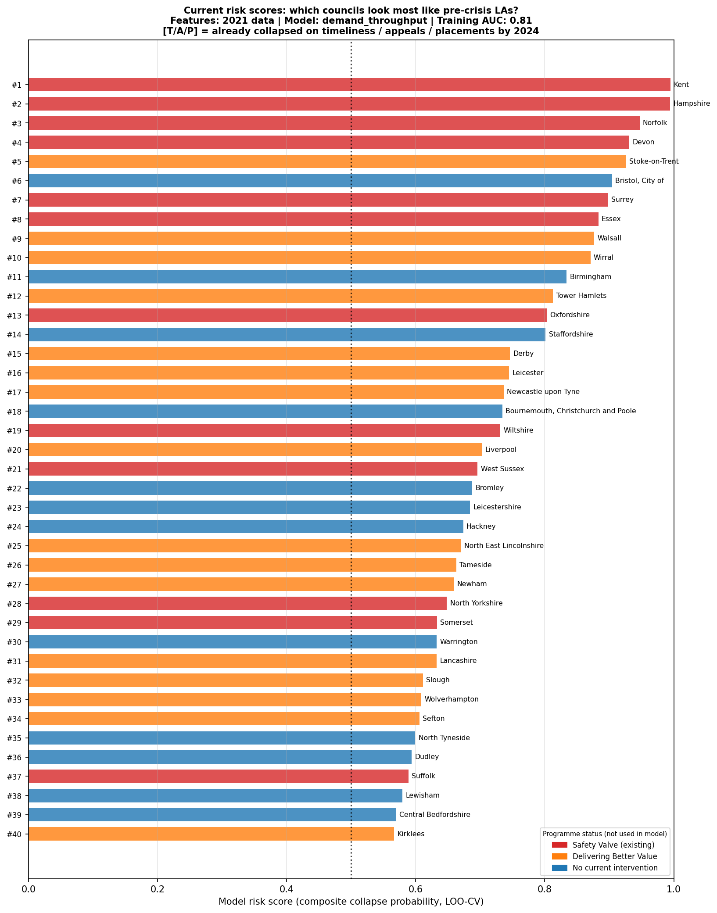
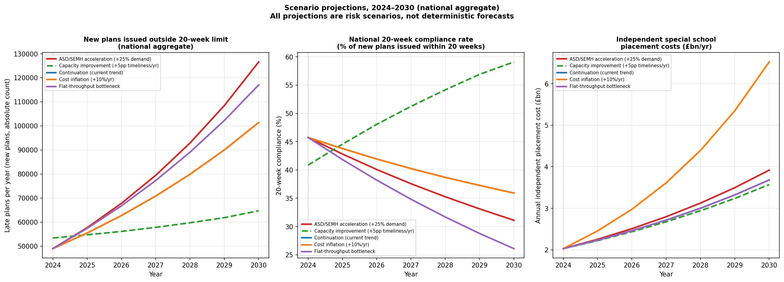

# England's SEND collapse had multiple early-warning signatures — and different councils now show each one

**An eight-model forecastability study finds that different types of SEND system failure had different predictive signals: timeliness failure was visible in absolute ASD and SEMH caseload growth; legal-pressure and placement-cost failure were visible in tribunal rates and independent-provider spend. The forecasting failure was not a lack of data, but a failure to combine demand, throughput, legal, and placement-market signals.**

*Forecastability analysis using DfE SEN2 2025, S251 expenditure 2015/16–2024/25, and SEND Tribunal data 2014–2024 | May 2026*

---

The collapse of EHCP services in England's most financially stressed local authorities did not arrive without warning. The data to predict it existed years before the crisis became visible. This analysis tests that claim directly: using only information available at each year from 2016 to 2021, how accurately could we have identified which councils would enter systemic failure by 2022–2024?

The headline result is clear, but the detail matters. Eight model families — from a simple total-demand baseline to a full specification combining need-type growth, tribunal history, independent placement spend, and timeliness trends — produce different answers depending on which type of collapse you are trying to predict. There was not one SEND collapse signal. There were at least two, with different causes and different early signatures.

---

## What "collapse" means in data

This analysis uses Safety Valve and Delivering Better Value programme status as comparison variables only. Programme status is a policy decision; what we are trying to predict is the underlying operational reality that programmes are a response to.

Three independent collapse definitions are derived from observable outcomes over 2022–2024:

**Timeliness collapse**: mean 20-week compliance below 40% over 2022–2024. Forty-seven councils (31%) fell below this threshold. In 2024, the national rate was 45.9%. The affected group is not a neat subset of any programme category.

**Legal-pressure collapse**: mean official SEND Tribunal appeal rate above the 75th percentile (4.1%) over 2022–2024. Thirty-five councils (23%) fell in this category.

**Placement/cost collapse**: independent special school placements above 3.6 per 1,000 pupils. Thirty-eight councils (25%) exceeded this threshold. A council in this category is typically spending £30–50 million annually on independent placements alone.

**Composite collapse**: any council flagging on two or more of the three definitions above. Twenty-four councils (16%) fell into this category. This is the analysis's central prediction target.

Each threshold is configurable in the analysis code.

---

## The question being tested

The previous version of this analysis asked: *was collapse foreseeable?* The answer was yes — from tribunal rates and independent placement spend available in 2016. The question left unanswered was more specific: *could absolute growth in ASD, SEMH, SLCN, and MLD caseloads — the demand-side shift that drove the crisis — have predicted which councils would fail?*

This matters for two reasons. First, if need-type growth alone predicted collapse, then the early warning was visible in the demand data without requiring access to tribunal records or placement spending — signals that reflect system deterioration already in progress. Second, if system-failure signals dominated, it suggests that the demand-side shift was not the direct cause of differential collapse: structural and financial factors beyond sheer caseload growth determined which councils failed.

Between 2016 and 2025, England's total active EHCP caseload roughly doubled. The growth was not uniform across need types. ASD and SEMH diagnoses drove the majority of the increase. By 2024, autistic spectrum disorder accounted for around 30% of all EHCPs nationally, up from 26% in 2016. The composition shift was visible in the data from the earliest years of the analysis window.

The indexed growth chart shows that ASD and SEMH grew at substantially faster rates than MLD and SLD through the period. The LA-level version of this pattern is the core predictive question.

---

## The eight model families

To directly test whether need-type growth predicted collapse, eight model families were evaluated using leave-one-out cross-validation (LOO-CV) for each training year from 2016 to 2021. The families were designed to isolate the contribution of different feature categories:

**Family A: Total EHCP demand** — total EHCP caseload level and log-linear growth rate only. This is the baseline: does raw demand volume predict which councils collapsed?

**Family B: Need-type absolute counts** — absolute EHCP counts and 3-year absolute growth in ASD, SEMH, SLCN, and MLD, with no tribunal, spend, or timeliness features. This directly tests whether the demand-type shift predicted collapse. (The analysis models four primary need types — ASD, SEMH, SLCN, and MLD — which together account for around 65% of all EHCPs nationally. SLD, PMLD, SpLD, and other categories are tracked in the data but excluded from the predictive models.)

**Family C: Need-type shares** — the percentage composition of the LA's EHCP caseload by need type. This tests whether the *composition* of demand matters independently of its *volume*.

**Families D, E, F** — need-type absolute counts plus, respectively, capacity proxies (independent top-up spend and EP service spend), throughput measures (20-week compliance and trend), and cost/financial measures (DSG balance and independent top-up percentage).

**Family G: System-failure signals** — SEND Tribunal appeal rate (level and trend) plus independent top-up spend as a percentage of DSG. This is the simplest model that performed best in the original analysis.

**Family H: Full model** — all available features from the above families combined.

**Data availability constraint**: Need-type counts at LA level are only available from the 2015/16–2019/20 release (real counts for 2016–2020) and the SEN2 2025 release (real counts for 2024/25). The years 2020/21–2023/24 have no published LA-level need-type breakdown. For training year 2021, need-type features use 2020 data as the most recent available. This means Models B–F and H can only produce 3-year growth features from training year 2019 onward, when enough historical years are available.

---

## The central finding: different signals predicted different collapse types

The AUC heatmap — showing leave-one-out cross-validated prediction accuracy for all eight model families across all six training years and four collapse definitions — produces a striking asymmetry. The answer to *did need-type growth predict collapse?* depends entirely on which type of collapse you are predicting.

**Timeliness collapse — demand growth was the dominant predictor; system signals were essentially useless.**

From 2019 data (when 3-year absolute growth features became available), Model B (need-type counts only, no tribunal or spend data) achieves an AUC of 0.69. By comparison, Model G (system-failure signals: tribunal rate and independent spend) achieves only 0.54 on the same target — barely above random. This reversal from every other collapse type is the analysis's most important finding.

Two important caveats apply. First, the margin between need-type counts (Model B) and total EHCP demand (Model A) is modest: Model A achieves AUC 0.65–0.70 for timeliness across training years, while Model B is in the same range (0.65–0.69 from 2019). Absolute need-type counts partly proxy LA size: a large council processing many cases of any type is more likely to struggle with timeliness. The cleaner distinction is that need-type *shares* (Model C) perform near-randomly (AUC ~0.49–0.52), confirming that the *composition* of demand matters much less than its absolute volume. The signal is in the total demand and its need-type components jointly, not in the proportional mix alone.

Second, the model is predictive, not causal. The finding is *consistent with* a workload-complexity mechanism — ASD and SEMH assessments are known to be more resource-intensive than MLD or SpLD cases, so rapid absolute growth in these need types could be compressing throughput capacity in a way that total caseload volume does not fully capture. But the model does not directly measure per-case workload, EP hours, plan-writing complexity, or multi-agency coordination demands. The interpretation should be: these features are associated with timeliness failure, in a pattern consistent with a demand-complexity explanation.

**Legal-pressure and placement collapse — system-failure signals dominated.**

For legal-pressure collapse (high tribunal rates), Model G achieves AUC 0.71 from 2016 data and 0.88 from 2021 data. Model B (need-type counts) achieves AUC 0.77 from 2019 data — meaningful, but consistently below G. The tribunal rate itself has strong autocorrelation: councils with high appeal rates in 2016–2018 continued to have high appeal rates in 2022–2024. This reflects a persistent structural condition — a combination of plan quality, parental expectation, and the local advice ecosystem — that is not primarily driven by recent caseload growth.

For placement/cost collapse, the pattern is similar: Model G achieves AUC 0.75–0.80 from 2018 onward; Model B reaches 0.70–0.73 from 2019. The full model (H) achieves the highest AUC for placement collapse (0.86 from 2019), suggesting that need-type growth and system signals together explain placement concentration better than either does alone. This is consistent with a pattern in which councils facing both high ASD/SEMH demand (associated with higher rates of specialist provision) and a high pre-existing reliance on independent placements were more likely to accumulate further placements — though the direction of causality between these factors cannot be established from the cross-sectional data.

**Composite collapse — signals dominated, but need-type growth contributed.**

Model G reaches AUC 0.73–0.75 from 2020–2021. Model B reaches 0.65 from 2019. For composite collapse, Model E (need-type counts plus timeliness trend) achieves the best overall result at 0.82, chosen as the basis for current risk scores. The combination of need-type growth and a council's own timeliness trajectory is more predictive than either alone — consistent with the finding that timeliness collapse and the other collapse types have partially distinct causes.

---

## What the signals were

The feature importance chart from the full model (H) at training years 2020 and 2021 shows which variables drove composite collapse prediction. The dominant features are consistent across both years:

**SEMH and ASD absolute counts and 3-year growth** appear with positive coefficients in the need-type features. A council with faster-growing SEMH and ASD caseloads in the 2016–2020 period was more likely to collapse across composite measures. The absolute count features (not just growth rates) contribute independently — reflecting that large ASD/SEMH caseloads create ongoing throughput pressure regardless of how rapidly they arrived.

**Independent top-up spend as a share of DSG** (from Model G) remains among the most powerful single predictors across all collapse types. A council committing a high proportion of its DSG to independent provider top-ups in 2016–2020 was systematically more likely to have collapsed by 2022–2024.

**Tribunal appeal rate** contributes strongly for legal-pressure collapse and moderately for composite collapse. Its near-zero coefficient for timeliness collapse confirms that the tribunal/spend signal and the need-type growth signal are capturing genuinely different risk pathways.

**20-week compliance** (available from 2019) is a powerful predictor once it enters — which is why Model E (counts + timeliness) achieves the best risk scores. A council already struggling with throughput in 2019–2021 was more likely to collapse across all definitions. But the pre-timeliness signals (need-type growth and tribunal rates) were already generating meaningful AUC before this data existed.

---

## The scatter pattern: ASD and SEMH growth by collapse outcome

The LA-level scatter plot shows the relationship between absolute growth in ASD and SEMH EHCPs from 2016 to 2020 and whether the council subsequently experienced timeliness or composite collapse. Councils that collapsed tend to cluster toward higher ASD and SEMH growth. The pattern is noisiest for composite collapse, where many high-growth councils did not collapse, and some low-growth councils did. This reflects that need-type growth was a necessary but not sufficient condition for composite collapse — the financial and structural factors captured by Model G also mattered.

For timeliness collapse, the separation is cleaner. Councils with very high SEMH growth 2016–2020 were disproportionately likely to have mean 20-week compliance below 40% by 2022–2024.

---

## Which councils already show the same risk signature?

The risk scores presented here use Model E (need-type counts plus timeliness trend), which achieves the highest LOO-CV AUC for composite collapse at 2021 features (0.82). This model combines the demand-side need-type growth signal with the throughput signal, neither of which uses Safety Valve or DBV status as an input. The scores measure structural similarity to councils that entered collapse — not a prediction of future programme entry or future failure.

Most of the top-ranked councils are already in DfE intervention programmes, validating the model: without programme status as a feature, it recovers the intervention group with high accuracy. The policy-relevant observation is the high-risk group with **no current DfE intervention**:

| Council | Risk score | Mean timeliness 2022–24 | Mean appeal rate | Indep./1,000 |
|---|---|---|---|---|
| Bristol, City of | 0.90 (Critical) | 37.5% | 2.9% | 2.55 |
| Birmingham | 0.82 (Critical) | 49.4% | 5.6% | 1.05 |
| Bromley | 0.77 (Critical) | 33.7% | 4.0% | 3.86 |
| Lewisham | 0.72 (High) | 53.5% | 2.6% | 5.28 |
| Staffordshire | 0.69 (High) | 33.5% | 5.3% | 4.65 |
| Central Bedfordshire | 0.64 (High) | 26.5% | 2.5% | 1.0 |

Several of these councils are already showing collapse-level metrics on individual indicators. Bristol's mean timeliness over 2022–2024 was 37.5% (below the 40% collapse threshold), Bromley's was 33.7%, and Staffordshire's was 33.5%. Central Bedfordshire's mean timeliness of 26.5% is among the worst individual performances of any council in the country. These are observations about the current data, not predictions about future programme entry.

---

## Scenarios: what happens next

For each of the 147 councils with complete projection data, five scenarios are projected to 2030 using each LA's own historical demand and throughput growth trends as the baseline.

**Continuation (current trend)**: Late plans rise from approximately 49,000 nationally in 2024 to approximately 101,000 by 2030. Independent placement costs rise from approximately £2.0 billion to £3.7 billion annually.

**ASD/SEMH acceleration (+25% additional demand growth)**: If the acceleration in autism and SEMH diagnoses continues at a higher rate, late plans rise to approximately 127,000 by 2030.

**Cost inflation (+10%/year for independent placements)**: If independent school fees continue to rise faster than general inflation, the annual independent placement bill reaches approximately £6.5 billion by 2030 — more than tripling — even without any increase in the number of placements.

**Capacity improvement (+5pp timeliness per year toward 65%)**: Investment in EP workforce and case officer capacity that improves 20-week compliance by 5 percentage points annually produces approximately 65,000 late plans by 2030 — still 30% above the 2024 level.

**Flat-throughput bottleneck**: Timely case capacity stays constant at its 2024 absolute level. Approximately 117,000 late plans per year by 2030.

The scenario range for late plans in 2030 is roughly 65,000 to 127,000 — a factor of two between the best and worst cases.

---

## What this means for policy

The primary finding is a refinement of the forecastability claim. It was not simply that "the data to predict collapse existed." The signals were different for different types of failure, and mixing them would have produced a less accurate early warning than using them appropriately.

For **timeliness failure** — the type most directly connected to the capacity collapse that Safety Valve councils experienced — the warning signal was in the demand data. Councils with high and growing absolute caseloads, particularly in ASD and SEMH, were associated with subsequent timeliness failure in a pattern not captured by tribunal or financial data. An early warning system monitoring absolute EHCP growth would have identified this group before the failure became acute — though it is important to note that this signal partly proxies total LA size, and that need-type *composition* (shares) was not useful independently of volume.

For **legal-pressure and placement failure** — the types most directly connected to DSG deficits and financial intervention — the warning signal was in the financial and legal data. Councils committing a high and rising share of their DSG to independent provider top-ups, while simultaneously attracting higher tribunal rates, were structurally committed to a different failure mode. An early warning system for this pathway could have been built from S251 returns and tribunal data that were both publicly available from 2015/16 onward.

The more immediate implication is for the councils that are now showing the same signals. Bristol, Bromley, and Staffordshire already show system-failure-level timeliness metrics. Central Bedfordshire, with mean timeliness of 26.5% over 2022–2024, is experiencing failure by any reasonable measure. The risk model says these councils look structurally similar to those that entered formal intervention. Whether the DfE is already engaging them is not visible in the public data.

An early warning system using these signals — absolute need-type growth, independent top-up spend as a percentage of DSG, and tribunal appeal rate — could have triggered earlier engagement and potentially prevented the most acute operational deterioration. The signals to build such a system are now publicly available. The question is whether they are being used.

**What this would have meant operationally.** A useful early-warning dashboard would not have asked only whether EHCP totals were rising. It would have tracked absolute ASD, SEMH, and SLCN caseload growth alongside timely assessment throughput, independent-provider exposure, tribunal pressure, and DSG carry-forward — because these signals warned of different kinds of collapse. Tracking only total demand would have missed the throughput-capacity squeeze before it became visible in timeliness statistics. Tracking only financial stress would have missed the legal-pressure failures in councils that were not yet in deficit. The monitoring failure was not a lack of data but a failure to combine demand, throughput, legal, and placement-market signals into a single picture — and to treat different collapse types as distinct policy problems requiring distinct early responses.

**The right question was not forecasting — it was stress testing.** It would be unfair to say the government should have predicted the exact rise in ASD or SEMH demand. Prevalence trends depend on diagnostic practice, parental awareness, school behaviour policy, post-pandemic mental health, and social change: these are not forecastable with precision, and no reasonable planning framework should be expected to get them right in advance.

But there is an important distinction between *forecasting* — predicting what will happen — and *stress testing* — asking what happens to the system *if* particular shocks occur, regardless of how likely they are. Banks stress test capital positions against recessions they cannot forecast. Energy systems stress test against supply shocks. Health systems model winter surge scenarios. A legally demand-led statutory entitlement system with long capacity lead times — one where new specialist school places take three to five years to build, and where EHCP legal rights are enforceable through the courts — is exactly the kind of system that needs resilience planning against plausible demand and cost shocks.

The government's 2014 SEND reform impact assessments, which are in the public record, projected roughly a one-to-one conversion from Statements to EHCPs — not a significant increase in the total number of children receiving statutory support. That projection proved materially wrong, as the NAO and parliamentary committees have subsequently noted. Whether DfE conducted additional internal modelling that went beyond the published assessments, and what it showed, is not publicly known. It would be unfair to assert that no stress testing took place simply because no evidence of it is public. What can be said is that the *public* monitoring framework — the indicators DfE published and watched — did not include absolute need-type growth rates, throughput capacity relative to incoming complexity, or independent-provider cost trends. If a stress-testing framework existed, it was not connected to visible early warning or action.

A useful stress test for SEND would not have required hundreds of bespoke forecasts. It would have needed five dimensions: demand shocks (ASD, SEMH, SLCN caseloads rising by 10%, 25%, 50%); throughput shocks (assessment capacity flat while demand grows); placement-capacity shocks (maintained specialist places delayed, independent provision absorbing the margin); cost shocks (independent placement fees rising at 5–15% per year, transport costs compounding, residential placements increasing); and legal-pressure shocks (tribunal volumes rising, officer time consumed by appeals, tribunal outcomes forcing higher-cost placements). The scenario projections in this analysis are a simplified version of exactly that matrix: they show a factor-of-two range in late plans by 2030, and a three-fold range in independent placement costs, depending on which combination of shocks materialises. The future is scenario-sensitive. That is the point of the exercise.

The policy question is not whether the government should have predicted the autism diagnosis rate in 2030. It is whether a statutory system designed to guarantee educational support to disabled children — in a context where demand had been rising for a decade, where independent placement costs were already compounding, and where tribunal pressure was already visible — should have been tested against the possibility that these trends would continue or accelerate. That is a much more defensible ask.

**What a competent government should have done, and when.** The critical complication is that the interventions that matter most have the longest lead times. Training an educational psychologist takes three to four years after a psychology degree. Building a new maintained special school takes four to six years from planning to first pupils. Establishing resourced provision units within existing mainstream schools takes one to two years. This means "wait until we are certain before acting" is structurally equivalent to not acting at all for the interventions with the longest lead times.

The relevant standard is not certainty but *prudent action under uncertainty*. Some interventions are low-regret: they remain worthwhile under a wide range of plausible futures, cost relatively little if demand turns out to have been overestimated, and become very costly to delay if demand continues to grow. Others are higher-regret: expensive, geographically fixed, hard to reverse. A competent government should have sequenced them accordingly.

| Intervention | Cost | Lead time | Low-regret? |
|---|---|---|---|
| Expand EP training places | Low | 3–4 years | Yes — useful under almost any demand scenario |
| Publish EHCP quality standards | Low | 6–12 months | Yes — reduces burden and tribunal risk regardless |
| Commission capacity audit | Low | 6–12 months | Yes — prerequisite for any capital decision |
| Resourced provision in mainstream schools | Medium | 1–2 years | Yes — flexible, reversible, local |
| New maintained special schools | High | 4–6 years | Moderate — requires demand confidence, long commitment |

The first full year of EHCP data (2015/16, published mid-2016) showed that the original one-to-one conversion assumption was already wrong: EHCP numbers were above Statement numbers and rising. That is enough to commission analysis, not enough to require capital expenditure. Once two consecutive years of above-expected growth were visible — by around 2016/17, with ASD and SEMH visibly driving the trend and rising independent top-up spend appearing in the S251 returns — a competent government had sufficient evidence to act on the low-regret, long-lead interventions. Two confirmed years of trend in a statutory demand-led system, with a known multi-year delivery lag, is a reasonable threshold. Waiting for a third or fourth year while the pipeline stood empty is where the obligation was missed.

By that point, three things should have begun: expanded EP training places (cheap, four-year lead time, obvious bottleneck); national EHCP quality standards (months to develop, reduces plan-writing burden and tribunal risk regardless of where demand lands); and a maintained specialist capacity audit to map where provision would need to grow. None of these require certainty about where demand ends up — they are the right actions under a range of plausible scenarios. Once a third year of data made the structural shift unambiguous and DSG stress began appearing in the published S251 returns, the case for a capital programme for resourced provision within mainstream schools — the fastest and most flexible way to create local maintained alternatives to independent placements — was clear.

It would not be fair to require new special school construction before the trend was confirmed over multiple years, or to require precise predictions about where ASD prevalence would land in 2030. What is fair to require is that a government operating a statutory entitlement system with known long-lead interventions begins the low-regret ones once a demand trend is confirmed, and plans the higher-regret ones once the trend is unambiguous. By the time the 2023 SEND and AP Improvement Plan focused seriously on workforce and specialist-capacity expansion — the right response — many councils were already deep into operational and financial crisis. The plan contained most of what was needed. It would have been considerably more effective had it begun several years earlier.

---

## Limitations

**Cross-sectional training data**: All models are trained on cross-sectional LA-level data. Collapse prediction partially captures autocorrelation (high tribunal rates in 2016 predict high rates in 2022–2024) as well as genuine structural risk.

**Need-type counts partly proxy LA size**: Absolute ASD and SEMH counts are correlated with total EHCP caseload, which is itself correlated with LA population. Model A (total demand) and Model B (need-type counts) produce similar AUC for timeliness collapse (~0.65–0.69). The cleaner result is that need-type *shares* are near-useless (AUC ~0.50), while absolute counts add signal. Whether need-type composition adds predictive value *beyond* total scale is marginal at most training years.

**Need-type data gap 2020/21–2023/24**: LA-level EHCP counts by primary need type are not published for these four years. The analysis uses real data from 2015/16–2019/20 (historical release) and 2024/25 (SEN2 2025). Training year 2021 features use 2020 need-type data as a proxy.

**Missing staffing data**: SEND team staffing (FTE per 1,000 active EHCPs) is not published at LA level. This is likely the single strongest predictor of throughput capacity failure and its absence may explain why timeliness collapse is harder to predict from early data than legal-pressure or placement collapse.

**No appeal grounds data**: The tribunal model uses overall appeal rates. Whether families are appealing refusals, plan contents, or placements matters for interpreting the mechanism.

**Scenario assumptions are simplified**: Scenario projections use each LA's own historical growth rate as the base and apply multiplicative adjustments. Real-world dynamics are not modelled.

**Model B requires 3yr growth**: Need-type absolute growth features are only available from training year 2019 onward (requiring 2016 as the baseline). Before 2019, Model B uses count levels only, which is weaker.

---

## Data and methodology

**Features used**: SEND Tribunal appeal rate 2014–2024 (DfE supporting file); S251 LA education expenditure 2015/16–2024/25; DfE SEN2 2025 (timeliness, requests, caseload, placements 2019–2024); historical EHCP need-type data 2015/16–2019/20 (DfE SEN2 2019–20 release, LA-level absolute counts by primary need); SEN2 2025 need-type data 2024/25 (LA-level absolute counts by primary need); SEN pupils 2024/25 (denominator).

**Target variables**: Computed from 2022–2024 SEN2 and caseload data. Thresholds are configurable. Safety Valve and DBV status are used as comparison variables in output charts only — not as features or targets in any model.

**Models**: Logistic regression with L2 regularisation (sklearn, C=1.0), class_weight='balanced', max_iter=1000. Features standardised with StandardScaler within each LOO fold. LOO-CV used throughout for unbiased AUC estimation with N≈140.

**Eight model families (A–H)**: See script configuration at top of `forecastability_analysis.py`. Family B uses only need-type absolute counts and 3-year absolute growth; Family G uses only tribunal appeal rate, trend, and independent top-up spend; Family H combines all available features.

**Forecastability rule**: For training year T, only data available at or before year T is used to construct features. The collapse window (2022–2024) is strictly after all training years.

The full analysis code is available at: **[github.com/Kali89/la-send-analysis](https://github.com/Kali89/la-send-analysis)**

---

*This analysis was conducted using publicly available data. Safety Valve and Delivering Better Value status are shown for context only and are not used in any predictive model.*

*The risk scores are model outputs, not official designations. They reflect structural similarity to councils that entered system collapse — not a prediction of DfE programme entry or legal classification.*

*Corrections and methodological challenges are welcome.*
