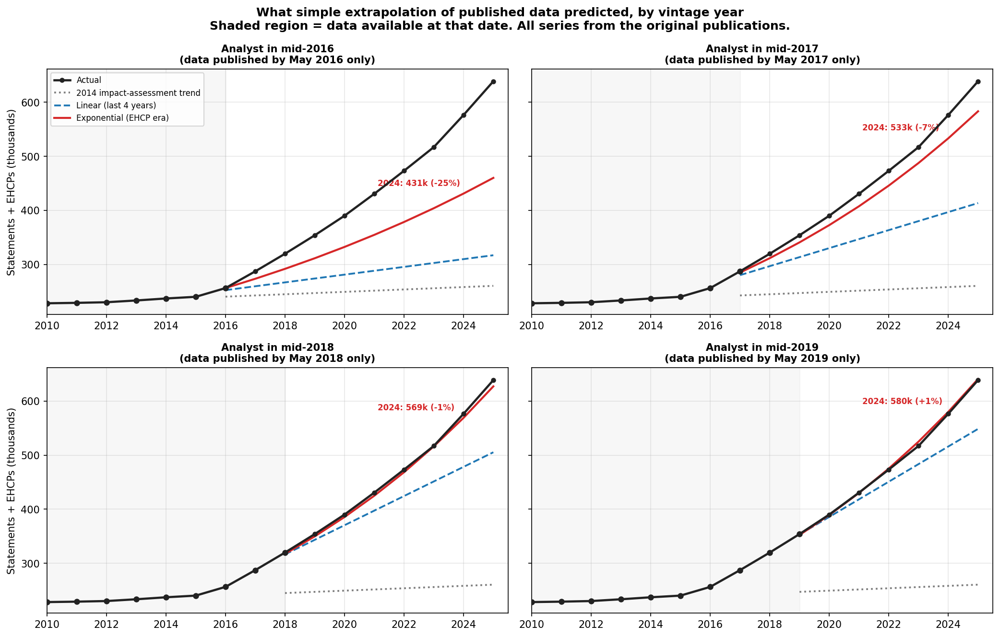
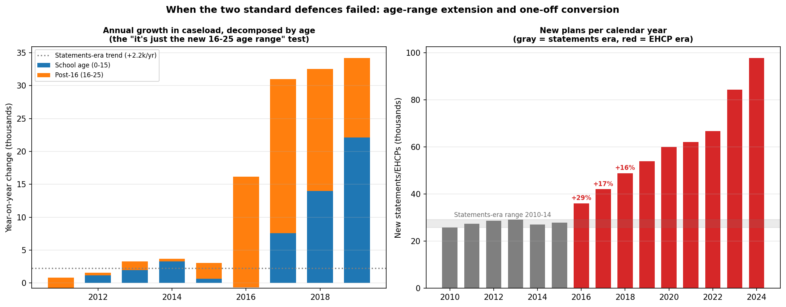
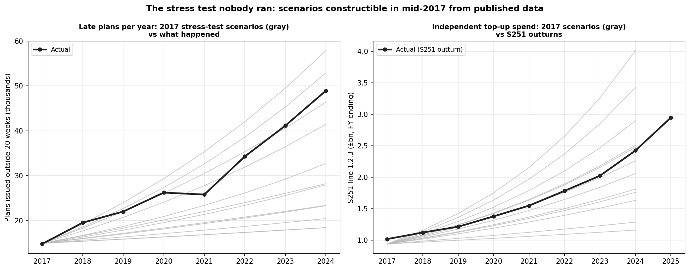
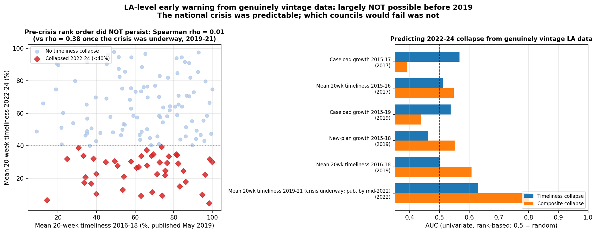
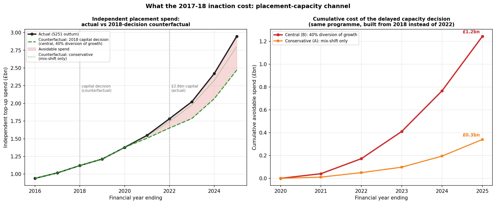

# A data-driven post-mortem of England's SEND crisis

**The national crisis was foreseeable from mid-2017 — a one-line extrapolation of the government's own published caseload statistics predicted the 2024 total within 8%, and within 1.3% a year later. What was *not* foreseeable was which councils would fail: council-level early warning from genuinely contemporaneous data performs no better than chance before 2019. The failure was therefore national, and so was the remedy that never came: workforce, capacity, and funding action that needed to start in 2017–18 to land in time.**

*Vintage backtest using the original DfE publications (SFR 17/2016, SEN2 2019), S251 outturns 2015/16–2024/25, and SEN2 2025 outcome data | August 2026*

---

> **Revision note.** This article replaces an earlier version whose foreseeability claims rested on cross-sectional models scoring AUC 0.70–0.88. Two of those claims did not survive scrutiny and are corrected here. First, the LA-level tribunal appeal-rate series used by those models was first published by the DfE in 2025 and was not available to a contemporaneous analyst; results built on it are an in-principle signal analysis, not evidence about what was knowable at the time. Second, when council-level prediction is re-run using only tables genuinely published by each date, it performs at chance (AUC 0.39–0.61) before 2019 — the earlier suggestion that specific failing councils could have been identified years ahead is not supported. The foreseeability evidence in this version comes instead from a publication-vintage backtest: every input is taken from the original statistical releases, dated to when they actually appeared. The result is a claim that is narrower, stronger, and checkable.

---

A post-mortem is not an exercise in blame. It is a structured attempt to reconstruct what was knowable, when it was knowable, what should have been done, and what the gap cost. This analysis applies that discipline to England's SEND system using a simple rule: **at each date, use only statistics that had actually been published by that date** — the original PDFs and spreadsheets, not modern datasets truncated to look old.

By January 2025 there were 638,745 EHC plans in England — 2.7 times the 2015 figure. In 2024, 48,900 plans were issued outside the 20-week legal limit, independent-placement top-up spending reached £2.4 billion a year, and 22,276 tribunal appeals were registered — seven times the 2015 figure.

None of the *scale* of this was hidden, and most of it was predictable. Here is exactly when, and how.

---

## Part One: The verdict — what was foreseeable, when

The test is deliberately primitive. Take the total caseload series exactly as published in each May statistical release; fit the simplest possible models; project to 2024; compare with what happened. No machine learning, no hindsight-selected features — arithmetic a single analyst could have done in a spreadsheet on the day each release came out.

| Analyst's vantage point | Data available | EHCP-era exponential predicts 2024 caseload | Error vs actual (576,474) |
|---|---|---|---|
| Mid-2016 | Jan 2010–2016 | 431,000 | −25% |
| **Mid-2017** | Jan 2010–2017 | **533,000** | **−7.5%** |
| **Mid-2018** | Jan 2010–2018 | **569,000** | **−1.3%** |
| Mid-2019 | Jan 2010–2019 | 580,000 | +0.6% |
| 2014 impact-assessment assumption (any year) | — | 258,000 | **−55%** |

Three things follow.

**From mid-2017, the demand crisis was quantitatively predictable.** An analyst who fitted an exponential to the first three EHCP-era data points — all published — would have told ministers in June 2017 to plan for roughly 530,000 plans by 2024. The eventual figure was 576,000. Even the 25%-low mid-2016 estimate was already 67% above the planning assumption government was actually using.

**The 2014 planning assumption was catastrophically wrong, and visibly so.** The reform's impact assessment envisaged roughly one-for-one conversion of statements to EHC plans — a continuation of the statements-era trend of about +1% a year. By May 2017 the published caseload was 36 standard deviations above that trend; by May 2019, 86. There is no reading of the published data after May 2017 under which the original assumption remained defensible.

**Foreseeing the scale did not require foreseeing the cause.** The extrapolation makes no claim about why demand rose — diagnosis rates, parental awareness, school incentives, the widened age range. It only required taking the published trend seriously in a system whose supply responses (psychologist training, school building) take three to six years.

The same picture holds for money and legal pressure, on a lag set by publication schedules:

- **Independent-placement spend** (S251 line 1.2.3): £940m in FY2015/16, growing 8–10% a year in every subsequent outturn. The first trend reading was available from late 2017; three consistent outturns by late 2018. It reached £2.4bn by FY2023/24 — the continuation, almost exactly, of the trend visible in 2018.
- **Tribunal registrations** (national, published annually by the Ministry of Justice): 3,121 in 2015, 3,843 in 2016, 4,956 in 2017, 5,980 in 2018 — up 92% in three years, before almost quadrupling again by 2024.

---

## Part Two: How — the two official defences, and when each one died

A fair post-mortem must credit the genuine ambiguity of the early data. In May 2016, the first EHCP-era release showed a caseload jump of 6.7% — but the DfE's own release attributed it to the mechanical extension of the age range to 16–25, and the age table supported that: school-age (0–15) numbers actually *fell* 0.3% that year, and new plans issued in 2015 (27,925) were still below the 2013 statements-era peak. In mid-2016, "this is the age extension plus one-off conversion effects" was a defensible reading. The post-mortem clock should not start there.

It starts a year later, because both defences then failed on the government's own published tables:

**The age-extension defence.** The May releases break the caseload down by age. School-age growth went from −0.3% (2016) to +3.6% (2017) to +6.3% (2018) to +9.4% (2019). By 2018 the majority of annual growth was school-age children — the age group the old statements system had always covered. The "it's just the new 16–25 cohort" explanation was directly refuted by the age table in the release that carried it.

**The one-off conversion defence.** Transfers from statements could inflate the stock, but not the flow of *new* plans, which the releases also published. New plans ran at 26–29k a year through 2010–2014. In 2016 they hit 36,094 — 24% above anything in the statements era — then 42,162 (+16%), then 48,907 (+16%). And the statutory transition ended in March 2018, after which conversion could explain nothing at all. From May 2017 the flow data contradicted the defence; from mid-2018 the defence was unavailable even in principle.

**When each signal crossed its threshold:**

| Release date | Caseload vs 2014 assumption | School-age growth | New plans vs statements-era peak | Independent top-up trend |
|---|---|---|---|---|
| May 2016 | +12.7σ | −0.3% | −4% | (first outturn only) |
| **May 2017** | **+35.9σ** | **+3.6%** | **+24%** | — |
| May/Dec 2018 | +60.2σ | +6.3% | +45% | +8–10%/yr on £1bn base |
| May 2019 | +85.9σ | +9.4% | +68% | trend confirmed 3rd year |

*(Full table: `outputs/tables/vintage_detection_tests.csv`; publication dates and lags per source: `outputs/tables/publication_audit.csv`.)*

---

## Part Three: The stress test nobody ran

Foreseeing demand is not the same as knowing the future — costs, throughput, and placement mix all had uncertain trajectories. That is what stress testing is for, and it is the standard discipline for systems that carry statutory obligations with long supply lead times. What would it have shown?

We replayed it. Using only figures published by mid-2017 — caseload 287,290, new plans 36,094, 20-week timeliness 58.6%, independent top-up £940m — we built a 36-cell scenario grid over demand growth (3% "reversion" to 11% "observed trend" and beyond), assessment throughput (flat capacity, +3%/yr, keeps pace), and placement cost inflation (0/5/10%).

The results (`outputs/tables/stress_test_2017.csv`):

- **Every actual 2024 outcome falls inside the 2017-constructible envelope** — caseload (576k in [354k, 629k]), late plans (49k in [18k, 58k]), independent top-up spend (£2.4bn in [£1.2bn, £4.0bn]).
- The actual outturn tracks the *middle* of the fan, not its edge. What happened was not a tail event; it was roughly the central scenario of a stress test no one ran.
- In **58% of scenario cells, independent-placement spend at least doubles by 2024**. A Treasury official shown this grid in 2017 would have seen that the high-needs budget was odds-on to break under most plausible futures.
- In every cell where assessment capacity fails to keep pace with demand, late plans multiply. The timeliness collapse was arithmetic: demand up 68% by 2019 against a flat assessment workforce.

The point of the exercise: the government did not need to *predict* the future. It needed to test the system against futures its own data made plausible — and almost all of them broke it.

---

## Part Four: What was NOT foreseeable — and why that matters

Here the post-mortem defends the government against the wrong charge, including a charge the earlier version of this analysis effectively made.

Using only tables genuinely published at the time (the May releases carried full LA-level breakdowns — caseload back to 2010, new plans, 20-week timeliness), we tested whether *which councils* would fail in 2022–24 was predictable:

It was not. Every LA-level vintage signal — caseload growth to 2017 or 2019, new-plan growth, timeliness levels — predicts 2022–24 collapse at an AUC between 0.39 and 0.61: chance, give or take noise. Most strikingly, **LA timeliness rank order completely reshuffled**: the Spearman correlation between a council's 2016–18 timeliness and its 2022–24 timeliness is 0.01. Norfolk went from 9% timely to 49%; Leicestershire from 98% to 5%; Portsmouth from 99% to 32%. Councils that looked robust drowned when the wave reached them; some early strugglers recovered. Only once the crisis was underway does persistence appear (2019–21 vs 2022–24: rho = 0.38; AUC 0.80 for composite collapse) — by which point "prediction" is mostly observation.

This has three consequences.

1. **"You should have intervened in [council X] in 2017" is a false charge.** No defensible analysis of the data available in 2017 identified Devon, Norfolk, or Kent as the coming failures.
2. **The failure was national, and only national action could have addressed it.** The binding constraints — educational psychologist supply, specialist capacity, the funding formula, plan quality standards — were all national. The data pointed at exactly those levers, because the *aggregate* signal was overwhelming while the council-level signal was noise.
3. **League-table early warning is the wrong monitoring design, then and now.** A dashboard ranking councils by predicted failure would have pointed at the wrong councils. A dashboard tracking five national series against planning assumptions would have fired loudly and correctly from 2017. (The five: caseload vs planning assumption; new-plan flow; school-age decomposition; independent top-up share of high-needs spend; timely-assessment throughput against incoming demand.)

---

## Part Five: Year by year — what a great job would have looked like

The interventions that mattered have long lead times: an educational psychologist takes three to four years to train; a maintained special school takes four to six years from approval to first intake; resourced provision in mainstream schools one to two years. "Wait until certain" therefore meant "act too late by construction". The standard applied below is prudent action under uncertainty, sequenced by regret: cheap, reversible things first; expensive, fixed things once the trend is unambiguous.

**2014 — at the reform's launch.** A great job: publish the impact assessment with explicit monitoring triggers ("if the caseload or new-plan flow departs from the conversion assumption for two consecutive years, the following review begins automatically") and a demand stress test, as is routine for fiscal and infrastructure programmes. What happened: an assumption of approximately one-for-one conversion, with no published trigger framework.

**Mid-2016 — first anomaly, honest ambiguity.** The data: +6.7% caseload, but attributable to the age extension; school-age flat; new plans normal. A great job: *flag, don't spend* — note the deviation, define the tripwires for next May's release, commission analysis of the age tables. This is also the year to have asked whether EP training numbers were adequate even under the official assumption. No serious failure yet.

**Mid-to-late 2017 — the pivot. This is where the post-mortem's clock starts.** The data by then: +12.1% caseload (36σ above the planning assumption); school-age growth positive and rising; new plans 24% above any statements-era year; and, by December, the first S251 outturns showing independent top-ups near £1bn. A one-line extrapolation now predicts the 2024 caseload within 8%. A great job, all low-regret:
- **Expand EP training intake for the 2018 cohort** (cheap; the 3–4 year pipeline means this lands 2021–22 — exactly when it was needed).
- **Commission a national specialist-capacity audit** (6–12 months; prerequisite for any capital decision).
- **Begin national EHCP quality standards** (reduces plan-writing burden and tribunal exposure under every scenario).
- **Run the stress test** (Part Three) and put its results in front of the Treasury ahead of the next spending round.
What happened: none of these.

**2018 — the defences die; the money signal confirms.** The data: +11.3% again (60σ); transition complete in March, so conversion explains nothing; new plans +45% over the statements-era peak; independent top-ups £1.12bn, growing 10% a year; tribunal registrations up 55% in two years; DSG deficits surfacing in council accounts. A great job: move to the medium-regret tier —
- **Capital programme for resourced provision in mainstream schools** (1–2 year lead; the fastest way to create maintained alternatives to £50k+ independent placements).
- **Start the maintained special-school pipeline** where the capacity audit indicates (4–6 year lead: places open 2022–24, as the caseload passes 500k).
- **Reform DSG deficit rules and the high-needs formula** on the basis of the projected — not lagged — caseload.
What happened: a £250m revenue top-up plus £100m capital over two years (December 2018) — a patch of roughly 4% of the high-needs budget against a caseload growing 11% a year — and a call for evidence.

**2019 — the diagnosis goes public; the response stays partial.** The data: 354k caseload (86σ); new plans +68% over peak; the extrapolation now lands within 1% of the eventual 2024 figure. The NAO (September 2019) and the Commons Education Committee (October 2019) both said, in substance, what Parts One and Two show. A great job: what became the 2023 SEND and AP Improvement Plan — a workforce plan, a capital pipeline, quality standards, a monitoring framework — enacted now, four years earlier, when the caseload was 354k rather than 517k. What happened: the SEND Review was launched (September 2019) and the spending round added over £700m of high-needs funding for 2020–21 — demand-following money, with the supply-side programme deferred.

**2020–2021 — compounding.** The pandemic accelerated demand (new plans 60k, then 62k) while assessment capacity stalled; timeliness held around 58–60% only because councils burned through goodwill and agency staff. The Safety Valve programme (from 2021) negotiated deficit-recovery plans council by council — treating the accounting symptom of a national supply failure, in some cases four years after the low-regret window. The review reported in 2022; the plan came in 2023; its capacity lands 2027–29 — a full decade after the 36σ signal.

### When action actually came: the signal-response ledger

Setting the signal dates against the action dates makes the lag explicit (full table: `outputs/tables/action_timeline.csv`):

| Signal | Response | Lag |
|---|---|---|
| May 2017: 36σ breach, new plans +24% over statements-era peak — low-regret window opens | Dec 2018: £250m revenue + £100m capital over two years (~4%/yr of the high-needs budget) | **19 months to first, token response** |
| May 2018: 60σ, transition complete, S251 trend confirmed — capital window | Mar 2022: £2.6bn high-needs capital 2022–25, places landing 2024–27 | **~4 years to the capital decision; ~6–9 years to places** |
| 2017: EP assessment bottleneck identifiable | Sept 2019: intake ~160→~200/yr (qualify 2023); Mar 2023: £21m, ~400/yr from Sept 2024 (qualify 2027+) | **2 years to a modest step; 6 years to the real one — capacity lands a decade after the signal** |
| 2018: deficit arithmetic implied by published trends | Nov 2020: statutory override (accounting); 2021–24: Safety Valve deals, >£1bn (deficit management) | **Symptom treatment from year 3; no supply-side content** |
| — | Mar 2022 green paper → Mar 2023 Improvement Plan → Feb 2026 white paper | **The systemic response arrived 6–9 years after the signal** |

Every response in the middle column is real money and real effort. The pattern is that the *demand-following* responses (revenue top-ups, deficit deals, accounting overrides) came first, and the *supply-side* responses (capital, workforce) — the ones with long lead times, which therefore needed to come first — came last.

### What the delay cost

`cost_of_delay.py` quantifies the placement-capacity channel with an explicit counterfactual: the capital programme government actually funded in March 2022 (£2.6bn, places 2024–27) is instead decided in mid-2018 — the date Part Two establishes the evidence supported — with resourced provision online from 2020–21 and school places from 2022. Maintained capacity then diverts a share of children who in fact went to independent placements (13,744 in 2019 → 29,647 in 2025), at the analysis's standard net saving of £75,000 per child-year (the S251 median independent cost is £97,322). Two scopes:

- **Conservative (mix-shift only)** — treats all placement *volume* growth as unavoidable and only the rise in the independent *share* (3.9% → 4.6% of caseload) as avoidable: **~£340m** of avoidable spend cumulative to FY2025 (sensitivity range £140–660m).
- **Central (40% diversion of growth)** — applies the cost-benefit model's base assumption that maintained capacity, had it existed, would have absorbed 40% of the *growth* in independent placements above the 2019 count: **~£1.24bn** cumulative to FY2025 (sensitivity range £0.5–2.4bn across 20–60% diversion and £60–97k savings).

The wedge is still widening: at FY2025 run-rates, **each further year without the capacity costs £145m–£477m in that year alone**, against a one-off programme cost of £2.6bn that government ended up paying anyway — four years later, at construction-inflated prices, with none of the interim savings banked.

The throughput channel adds the human cost. Had 20-week performance merely held at its 2019 level — plausible if EP cohorts expanded from September 2018 had been qualifying from 2021–22 — roughly **26,600 fewer children** would have waited beyond the legal limit over 2022–24 alone (7,200 in 2022, 7,700 in 2023, 11,600 in 2024). Each of those is months of a child's schooling without the support a statutory process existed to provide.

For context rather than addition (these are overlapping manifestations, not separate costs): cumulative DSG deficits passed **£3.3bn** by end-2024 and are held off council balance sheets by a statutory override expiring March 2026; Safety Valve payments to 38 councils exceed **£1bn**; and high-needs revenue funding rose from ~£6.0bn (2018–19) to £10.7bn (2024–25) — an increase that followed the deficits rather than pre-empting the demand that was visible in 2017. The counterfactual numbers above are the portion of this that a timely capital and workforce decision could plausibly have avoided; the rest is the price of demand growth that no early action would have prevented — but that early action would have met with places instead of deficits.

None of this required foresight beyond the published trend. The EP cohorts not expanded in 2017–18 are precisely the assessment capacity missing in 2021–24; the places not commissioned in 2018 are precisely the independent placements bought at £97k a year in 2023–25.

---

## Part Six: Who should have been doing what

| Actor | Had by 2017–18 | Should have done | Actually did |
|---|---|---|---|
| **DfE analysis & statistics** | All of Part One's data (they published it) | Maintain a caseload-vs-assumption tracker; escalate the 2017 breach; run the stress test | Published excellent releases; no visible tracking against planning assumptions |
| **DfE SEND policy** | The May releases; S251; its own IA | Trigger low-regret responses 2017 (EP training, quality standards, capacity audit); capital from 2018 | First funding patch Dec 2018; Review Sept 2019; Plan Mar 2023 |
| **HM Treasury** | S251 trend; the deficit arithmetic | Demand-based (not lagged) high-needs baseline at the 2019 spending round; fund the stress-tested scenario | Funded lagged demand: +£700m for 2020–21, after deficits had already formed |
| **Local authorities** | Their own caseload and deficit data | Sufficiency strategies; honest deficit reporting (many did both) | Limited agency: the binding constraints — EP supply, capital, the formula — were national |
| **NAO / Education Committee** | Public data | The 2019 diagnosis, earlier | Did their job well in 2019; the machinery responded slowly |
| **Ofsted/CQC area SEND inspections (from 2016)** | Local qualitative evidence | Aggregate findings into a national capacity signal | Surfaced quality failures locally; no national quantitative synthesis |

The pattern across the table: nobody's *data* failed. The gap was between publication and planning — no institutional mechanism existed that compared what the statistics said against what the system was resourced for, and pulled an alarm when they diverged by 36 standard deviations.

---

## Part Seven: What this means now

**Monitor trends against assumptions, not councils against each other.** The five-series national dashboard (caseload vs planning assumption, new-plan flow, school-age decomposition, independent top-up share, throughput vs demand) is constructible today from the same publications, with explicit tripwires attached to the current reform's planning assumptions — including the 2026 white paper's. The white paper's own demand assumptions should be published with the monitoring triggers the 2014 reform never had, precisely because this post-mortem shows breaches go unactioned when no trigger exists.

**Council-level prediction remains weak, and policy should stop pretending otherwise.** Risk scores built on current data identify councils already deteriorating (that is observation, and useful for support targeting); they did not and largely cannot identify next failures years ahead. Resilience has to be built system-wide.

**Supply lead times set the decision calendar.** Whatever the demand assumption, EP training intakes and capital pipelines sized to the *stress-tested* range — not the central forecast — are the insurance a statutory entitlement system owes its beneficiaries. The premium is small: training places and audits cost millions; the realised crisis costs billions a year.

---

## Data, methodology, limitations

**Method**: All vintage inputs are from the original releases: SFR 17/2016 (published 26 May 2016) and SEN2 2019 tables (30 May 2019), downloaded from gov.uk and parsed directly (`data/raw/vintage/`); S251 outturns; MoJ-derived national tribunal counts. Outcome data (2020–2025) from SEN2 2025. Full reproduction: `vintage_backtest.py`; series: `outputs/tables/vintage_national_series.csv`; per-source publication dates and lags: `outputs/tables/publication_audit.csv`.

**Limitations**:
- The exponential model is evaluated retrospectively; a 2017 analyst could not have known growth would stay near-exponential for seven more years. The claim defended here is narrower: every plausible reading of the mid-2017 data implied demand far above the planning assumption, and the stress-test envelope (which does not assume continued exponential growth) still contained everything that happened.
- The vintage LA-level null result is a statement about simple signals (levels and growth of caseload, new plans, timeliness). It cannot exclude that some richer contemporaneous dataset would have predicted council failure — but none of the candidates proposed since (tribunal rates, spend shares) were published at LA level early enough, and the earlier version of this analysis shows even they perform modestly before 2020.
- Early-years LA timeliness data (2014–2016) covers small EHCP volumes during transition and includes reporting quirks; this strengthens rather than weakens the conclusion that it was an unusable early-warning basis.
- Spending figures are nominal. Deflating them weakens nothing: real independent top-up spend still roughly doubled over the period.
- The cost-of-delay figures are counterfactual estimates, not observed savings. They inherit the cost-benefit model's diversion assumptions (base 40%, i.e. most independent placements are assumed to reflect genuine specialist need that maintained capacity would *not* have met) and a fixed £75k net saving per diverted child-year; the sensitivity grid (`cost_of_delay_sensitivity.csv`) spans 20–60% diversion and £60–97k. The conservative (mix-shift) scope is close to a floor: it assumes every additional placement was unavoidable and only the change in placement *mix* was not. Unmodelled channels cut both ways: earlier capacity might also have moderated independent-sector fee inflation and tribunal-driven placements (upside), while programme delivery at 2018 prices and speed is assumed to match what the 2022 programme actually achieved (downside risk).
- The December 2018 (£250m + £100m) and September 2019 (£700m+) funding figures are from contemporary government announcements and reporting.

*Corrections and methodological challenges are welcome: the entire pipeline is public at [github.com/Kali89/la-send-analysis](https://github.com/Kali89/la-send-analysis).*
